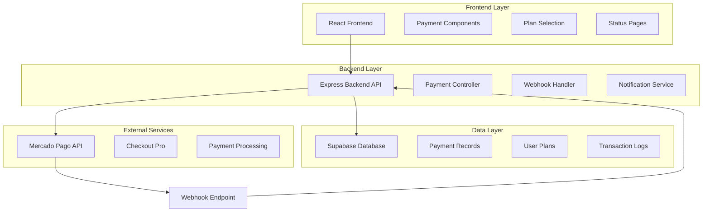
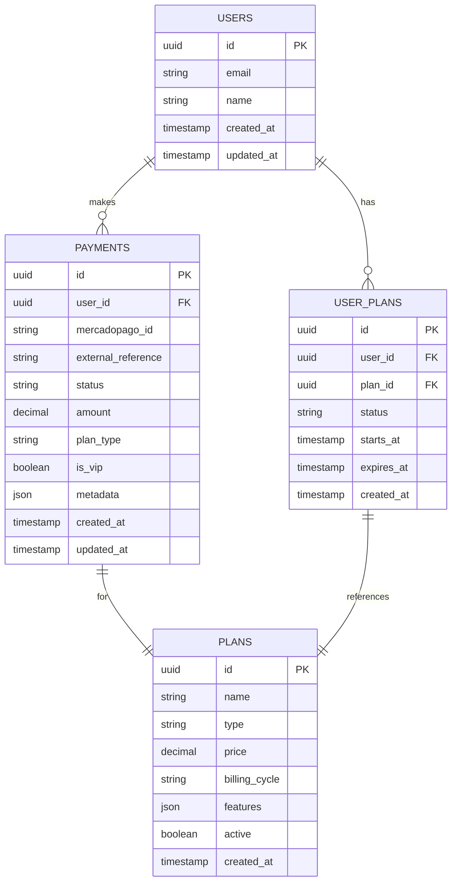

# Arquitetura Técnica - Integração Mercado Pago Checkout Pro

## 1. Arquitetura Geral do Sistema



## 2. Especificações Técnicas

### 2.1 Stack Tecnológico

**Frontend:**

* React 18 + TypeScript

* Vite (build tool)

* TailwindCSS (styling)

* @mercadopago/sdk-react

* React Router DOM

**Backend:**

* Node.js + Express

* TypeScript

* mercadopago SDK

* CORS middleware

* Express rate limiting

**Database:**

* Supabase (PostgreSQL)

* Real-time subscriptions

* Row Level Security (RLS)

### 2.2 Estrutura de Rotas

| Rota Frontend      | Propósito           | Componente     |
| ------------------ | ------------------- | -------------- |
| `/plans`           | Página de planos    | PlansPage      |
| `/payment/success` | Pagamento aprovado  | PaymentSuccess |
| `/payment/failure` | Pagamento rejeitado | PaymentFailure |
| `/payment/pending` | Pagamento pendente  | PaymentPending |

| Rota Backend                     | Método | Propósito              |
| -------------------------------- | ------ | ---------------------- |
| `/api/payment/create-preference` | POST   | Criar preferência MP   |
| `/api/webhook`                   | POST   | Receber notificações   |
| `/api/payment/status/:id`        | GET    | Consultar status       |
| `/api/user/plan`                 | GET    | Obter plano do usuário |

## 3. Definições de API

### 3.1 Criar Preferência de Pagamento

**Endpoint:** `POST /api/payment/create-preference`

**Request:**

```typescript
interface CreatePreferenceRequest {
  planType: 'monthly' | 'yearly';
  isVip: boolean;
  userEmail: string;
  userId?: string;
}
```

**Response:**

```typescript
interface CreatePreferenceResponse {
  preferenceId: string;
  initPoint: string;
  sandboxInitPoint: string;
  externalReference: string;
}
```

**Exemplo:**

```json
{
  "planType": "monthly",
  "isVip": true,
  "userEmail": "user@example.com",
  "userId": "123e4567-e89b-12d3-a456-426614174000"
}
```

### 3.2 Webhook de Notificação

**Endpoint:** `POST /api/webhook`

**Request:**

```typescript
interface WebhookNotification {
  id: number;
  live_mode: boolean;
  type: 'payment' | 'plan' | 'subscription';
  date_created: string;
  application_id: number;
  user_id: string;
  version: number;
  api_version: string;
  action: 'payment.created' | 'payment.updated';
  data: {
    id: string;
  };
}
```

### 3.3 Status do Pagamento

**Endpoint:** `GET /api/payment/status/:paymentId`

**Response:**

```typescript
interface PaymentStatus {
  id: string;
  status: 'pending' | 'approved' | 'rejected' | 'cancelled';
  status_detail: string;
  external_reference: string;
  transaction_amount: number;
  date_created: string;
  date_approved?: string;
}
```

## 4. Modelo de Dados

### 4.1 Diagrama ER



### 4.2 DDL (Data Definition Language)

```sql
-- Tabela de usuários (pode já existir)
CREATE TABLE IF NOT EXISTS users (
    id UUID PRIMARY KEY DEFAULT gen_random_uuid(),
    email VARCHAR(255) UNIQUE NOT NULL,
    name VARCHAR(255),
    created_at TIMESTAMP WITH TIME ZONE DEFAULT NOW(),
    updated_at TIMESTAMP WITH TIME ZONE DEFAULT NOW()
);

-- Tabela de planos
CREATE TABLE plans (
    id UUID PRIMARY KEY DEFAULT gen_random_uuid(),
    name VARCHAR(255) NOT NULL,
    type VARCHAR(50) NOT NULL, -- 'monthly', 'yearly'
    price DECIMAL(10,2) NOT NULL,
    billing_cycle VARCHAR(20) NOT NULL,
    features JSONB,
    active BOOLEAN DEFAULT true,
    created_at TIMESTAMP WITH TIME ZONE DEFAULT NOW()
);

-- Tabela de pagamentos
CREATE TABLE payments (
    id UUID PRIMARY KEY DEFAULT gen_random_uuid(),
    user_id UUID REFERENCES users(id),
    mercadopago_id VARCHAR(255) UNIQUE,
    external_reference VARCHAR(255),
    status VARCHAR(50) NOT NULL,
    amount DECIMAL(10,2) NOT NULL,
    plan_type VARCHAR(50),
    is_vip BOOLEAN DEFAULT false,
    metadata JSONB,
    created_at TIMESTAMP WITH TIME ZONE DEFAULT NOW(),
    updated_at TIMESTAMP WITH TIME ZONE DEFAULT NOW()
);

-- Tabela de planos do usuário
CREATE TABLE user_plans (
    id UUID PRIMARY KEY DEFAULT gen_random_uuid(),
    user_id UUID REFERENCES users(id),
    plan_id UUID REFERENCES plans(id),
    payment_id UUID REFERENCES payments(id),
    status VARCHAR(50) DEFAULT 'active', -- 'active', 'expired', 'cancelled'
    starts_at TIMESTAMP WITH TIME ZONE DEFAULT NOW(),
    expires_at TIMESTAMP WITH TIME ZONE,
    created_at TIMESTAMP WITH TIME ZONE DEFAULT NOW()
);

-- Índices para performance
CREATE INDEX idx_payments_user_id ON payments(user_id);
CREATE INDEX idx_payments_mercadopago_id ON payments(mercadopago_id);
CREATE INDEX idx_payments_status ON payments(status);
CREATE INDEX idx_user_plans_user_id ON user_plans(user_id);
CREATE INDEX idx_user_plans_status ON user_plans(status);

-- Dados iniciais dos planos
INSERT INTO plans (name, type, price, billing_cycle, features) VALUES
('Plano Profissional Mensal', 'monthly', 68.90, 'monthly', 
 '{"features": ["Sistema completo de orçamentos", "Gestão de clientes ilimitada", "Relatórios e estatísticas"]}'),
('Plano Profissional Anual', 'yearly', 638.55, 'yearly', 
 '{"features": ["Sistema completo de orçamentos", "Gestão de clientes ilimitada", "Relatórios e estatísticas", "2 meses de economia"]}');

-- RLS (Row Level Security) policies
ALTER TABLE payments ENABLE ROW LEVEL SECURITY;
ALTER TABLE user_plans ENABLE ROW LEVEL SECURITY;

-- Política para usuários autenticados
CREATE POLICY "Users can view own payments" ON payments
    FOR SELECT USING (auth.uid() = user_id);

CREATE POLICY "Users can view own plans" ON user_plans
    FOR SELECT USING (auth.uid() = user_id);

-- Política para inserção (via service role)
CREATE POLICY "Service can insert payments" ON payments
    FOR INSERT WITH CHECK (true);

CREATE POLICY "Service can update payments" ON payments
    FOR UPDATE USING (true);
```

## 5. Configuração de Ambiente

### 5.1 Variáveis de Ambiente

```bash
# Frontend (.env)
VITE_MERCADOPAGO_PUBLIC_KEY=TEST-your-public-key
VITE_API_URL=http://localhost:3001
VITE_SUPABASE_URL=your-supabase-url
VITE_SUPABASE_ANON_KEY=your-supabase-anon-key

# Backend (.env)
PORT=3001
NODE_ENV=development

# Mercado Pago
MERCADOPAGO_ACCESS_TOKEN=TEST-your-access-token
MERCADOPAGO_PUBLIC_KEY=TEST-your-public-key

# URLs
FRONTEND_URL=http://localhost:5173
WEBHOOK_URL=https://your-backend.vercel.app

# Supabase
SUPABASE_URL=your-supabase-url
SUPABASE_SERVICE_ROLE_KEY=your-service-role-key

# Segurança
JWT_SECRET=your-jwt-secret
WEBHOOK_SECRET=your-webhook-secret
```

### 5.2 Configuração do Supabase

```typescript
// src/config/supabase.ts
import { createClient } from '@supabase/supabase-js';

const supabaseUrl = process.env.SUPABASE_URL!;
const supabaseServiceKey = process.env.SUPABASE_SERVICE_ROLE_KEY!;

export const supabase = createClient(supabaseUrl, supabaseServiceKey, {
  auth: {
    autoRefreshToken: false,
    persistSession: false
  }
});

// Tipos TypeScript para o banco
export interface Database {
  public: {
    Tables: {
      payments: {
        Row: {
          id: string;
          user_id: string;
          mercadopago_id: string;
          status: string;
          amount: number;
          created_at: string;
        };
        Insert: {
          user_id: string;
          mercadopago_id: string;
          status: string;
          amount: number;
        };
      };
      user_plans: {
        Row: {
          id: string;
          user_id: string;
          plan_id: string;
          status: string;
          expires_at: string;
        };
      };
    };
  };
}
```

## 6. Implementação de Segurança

### 6.1 Validação de Webhook

```typescript
// src/middleware/webhookValidation.ts
import crypto from 'crypto';
import { Request, Response, NextFunction } from 'express';

export const validateMercadoPagoWebhook = (
  req: Request, 
  res: Response, 
  next: NextFunction
) => {
  const signature = req.headers['x-signature'] as string;
  const requestId = req.headers['x-request-id'] as string;
  
  if (!signature || !requestId) {
    return res.status(400).json({ error: 'Missing signature headers' });
  }
  
  // Extrair timestamp e hash da assinatura
  const parts = signature.split(',');
  let ts: string | undefined;
  let hash: string | undefined;
  
  parts.forEach(part => {
    const [key, value] = part.split('=');
    if (key === 'ts') ts = value;
    if (key === 'v1') hash = value;
  });
  
  if (!ts || !hash) {
    return res.status(400).json({ error: 'Invalid signature format' });
  }
  
  // Verificar timestamp (não mais que 5 minutos)
  const currentTime = Math.floor(Date.now() / 1000);
  if (currentTime - parseInt(ts) > 300) {
    return res.status(400).json({ error: 'Request too old' });
  }
  
  // Calcular hash esperado
  const dataId = req.query['data.id'] || req.body?.data?.id;
  const manifest = `id:${dataId};request-id:${requestId};ts:${ts};`;
  
  const expectedHash = crypto
    .createHmac('sha256', process.env.WEBHOOK_SECRET!)
    .update(manifest)
    .digest('hex');
  
  if (hash !== expectedHash) {
    return res.status(400).json({ error: 'Invalid signature' });
  }
  
  next();
};
```

### 6.2 Rate Limiting

```typescript
// src/middleware/rateLimiting.ts
import rateLimit from 'express-rate-limit';

export const paymentRateLimit = rateLimit({
  windowMs: 15 * 60 * 1000, // 15 minutos
  max: 10, // máximo 10 tentativas de pagamento por IP
  message: {
    error: 'Muitas tentativas de pagamento. Tente novamente em 15 minutos.'
  },
  standardHeaders: true,
  legacyHeaders: false
});

export const webhookRateLimit = rateLimit({
  windowMs: 1 * 60 * 1000, // 1 minuto
  max: 100, // máximo 100 webhooks por minuto
  skip: (req) => {
    // Pular rate limiting para IPs do Mercado Pago
    const mercadoPagoIPs = [
      '209.225.49.0/24',
      '216.33.197.0/24'
    ];
    // Implementar verificação de IP
    return false;
  }
});
```

## 7. Monitoramento e Logs

### 7.1 Sistema de Logging

```typescript
// src/utils/logger.ts
import winston from 'winston';

const logger = winston.createLogger({
  level: process.env.LOG_LEVEL || 'info',
  format: winston.format.combine(
    winston.format.timestamp(),
    winston.format.errors({ stack: true }),
    winston.format.json()
  ),
  defaultMeta: { service: 'mercadopago-integration' },
  transports: [
    new winston.transports.File({ 
      filename: 'logs/error.log', 
      level: 'error' 
    }),
    new winston.transports.File({ 
      filename: 'logs/combined.log' 
    })
  ]
});

if (process.env.NODE_ENV !== 'production') {
  logger.add(new winston.transports.Console({
    format: winston.format.simple()
  }));
}

export { logger };
```

### 7.2 Métricas de Performance

```typescript
// src/middleware/metrics.ts
import { Request, Response, NextFunction } from 'express';
import { logger } from '../utils/logger';

export const metricsMiddleware = (
  req: Request, 
  res: Response, 
  next: NextFunction
) => {
  const start = Date.now();
  
  res.on('finish', () => {
    const duration = Date.now() - start;
    
    logger.info('Request completed', {
      method: req.method,
      url: req.url,
      statusCode: res.statusCode,
      duration,
      userAgent: req.get('User-Agent'),
      ip: req.ip
    });
  });
  
  next();
};
```

## 8. Testes Automatizados

### 8.1 Configuração de Testes

```typescript
// tests/setup.ts
import { beforeAll, afterAll } from 'vitest';
import { createServer } from '../src/app';

let server: any;

beforeAll(async () => {
  server = createServer();
  await server.listen(0); // porta aleatória
});

afterAll(async () => {
  await server.close();
});
```

### 8.2 Testes de Integração

```typescript
// tests/payment.integration.test.ts
import { describe, it, expect } from 'vitest';
import request from 'supertest';
import { app } from '../src/app';

describe('Payment Integration', () => {
  it('should create payment preference', async () => {
    const response = await request(app)
      .post('/api/payment/create-preference')
      .send({
        planType: 'monthly',
        isVip: false,
        userEmail: 'test@example.com'
      })
      .expect(200);
    
    expect(response.body).toHaveProperty('preferenceId');
    expect(response.body).toHaveProperty('initPoint');
  });
  
  it('should handle webhook notification', async () => {
    const webhookPayload = {
      type: 'payment',
      action: 'payment.updated',
      data: { id: 'test-payment-id' }
    };
    
    await request(app)
      .post('/api/webhook')
      .send(webhookPayload)
      .expect(200);
  });
});
```

## 9. Deploy e CI/CD

### 9.1 Configuração Vercel (Backend)

```json
// vercel.json
{
  "version": 2,
  "builds": [
    {
      "src": "dist/app.js",
      "use": "@vercel/node"
    }
  ],
  "routes": [
    {
      "src": "/(.*)",
      "dest": "dist/app.js"
    }
  ],
  "env": {
    "NODE_ENV": "production"
  }
}
```

### 9.2 GitHub Actions

```yaml
# .github/workflows/deploy.yml
name: Deploy

on:
  push:
    branches: [main]

jobs:
  test:
    runs-on: ubuntu-latest
    steps:
      - uses: actions/checkout@v3
      - uses: actions/setup-node@v3
        with:
          node-version: '18'
      - run: npm ci
      - run: npm test
  
  deploy-backend:
    needs: test
    runs-on: ubuntu-latest
    steps:
      - uses: actions/checkout@v3
      - uses: amondnet/vercel-action@v20
        with:
          vercel-token: ${{ secrets.VERCEL_TOKEN }}
          vercel-org-id: ${{ secrets.ORG_ID }}
          vercel-project-id: ${{ secrets.PROJECT_ID }}
```

***

**Observações Importantes:**

1. **Segurança**: Sempre validar webhooks e usar HTTPS em produção
2. **Performance**: Implementar cache para consultas frequentes
3. **Monitoramento**: Configurar alertas para falhas de pagamento
4. **Backup**: Manter backup regular dos dados de pagamento
5. **Compliance**: Seguir normas PCI DSS para dados de pagamento

