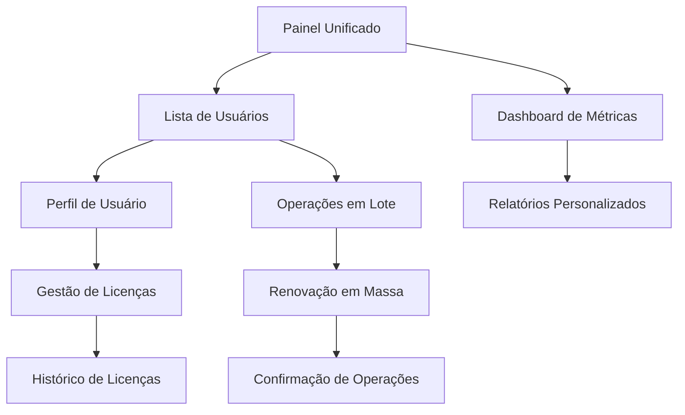

# Aprimoramento do Gerenciamento de Usuários e Integração com Licenças

## 1. Visão Geral do Produto

Este documento detalha o aprimoramento da seção de gerenciamento de usuários no painel administrativo, integrando-a com a funcionalidade de gerenciamento de licenças para criar uma experiência unificada e eficiente. O objetivo é proporcionar aos administradores uma interface centralizada para gerenciar usuários e suas licenças de forma integrada, melhorando a produtividade e reduzindo a complexidade operacional.

## 2. Funcionalidades Principais

### 2.1 Papéis de Usuário

| Papel | Método de Registro | Permissões Principais |
|-------|-------------------|----------------------|
| Administrador | Convite por super admin | Gerenciar usuários, licenças, configurações do sistema |
| Usuário Premium | Ativação de licença | Acesso completo às funcionalidades premium |
| Usuário Básico | Registro por email | Acesso limitado às funcionalidades básicas |

### 2.2 Módulos de Funcionalidade

Nosso sistema aprimorado consiste nas seguintes páginas principais:

1. **Painel de Gerenciamento Unificado**: visão consolidada de usuários e licenças, estatísticas em tempo real, ações rápidas.
2. **Perfil de Usuário Avançado**: informações detalhadas do usuário, histórico de licenças, métricas de uso.
3. **Gerenciamento de Licenças Integrado**: atribuição de licenças, renovação em lote, monitoramento de expiração.
4. **Analytics e Relatórios**: dashboards de uso, relatórios de licenças, análise de tendências.
5. **Configurações e Automação**: regras de renovação automática, notificações personalizadas, workflows.

### 2.3 Detalhes das Páginas

| Nome da Página | Nome do Módulo | Descrição da Funcionalidade |
|----------------|----------------|-----------------------------|
| Painel Unificado | Dashboard Principal | Exibir estatísticas consolidadas de usuários e licenças, alertas de expiração, ações rápidas para operações comuns |
| Painel Unificado | Lista de Usuários Integrada | Mostrar usuários com status de licença, filtros avançados por tipo de licença, busca unificada |
| Painel Unificado | Ações em Lote | Permitir seleção múltipla de usuários, operações de licença em massa, exportação de dados |
| Perfil de Usuário | Informações Básicas | Editar dados pessoais, visualizar histórico de atividades, gerenciar preferências |
| Perfil de Usuário | Gestão de Licenças | Visualizar licenças ativas, histórico de renovações, datas de expiração |
| Perfil de Usuário | Métricas de Uso | Mostrar estatísticas de uso, tempo de atividade, recursos mais utilizados |
| Gerenciamento de Licenças | Atribuição de Licenças | Associar licenças a usuários, validar disponibilidade, configurar datas de expiração |
| Gerenciamento de Licenças | Renovação Automática | Configurar regras de renovação, processar renovações em lote, notificar usuários |
| Gerenciamento de Licenças | Monitoramento | Rastrear status de licenças, alertas de expiração, relatórios de uso |
| Analytics | Dashboard de Métricas | Visualizar KPIs de usuários e licenças, gráficos de tendências, comparativos |
| Analytics | Relatórios Personalizados | Gerar relatórios específicos, exportar dados, agendar relatórios automáticos |
| Configurações | Automação | Definir regras de negócio, configurar notificações, gerenciar workflows |

## 3. Processo Principal

### Fluxo do Administrador

1. **Acesso ao Painel**: O administrador acessa o painel unificado e visualiza o dashboard com estatísticas consolidadas
2. **Gerenciamento de Usuários**: Navega pela lista integrada de usuários com informações de licença em tempo real
3. **Operações de Licença**: Realiza atribuições, renovações ou revogações de licenças diretamente da interface de usuários
4. **Monitoramento**: Acompanha métricas de uso e recebe alertas sobre licenças próximas ao vencimento
5. **Relatórios**: Gera relatórios personalizados para análise de tendências e tomada de decisões

### Fluxo de Operações em Lote

1. **Seleção**: O administrador seleciona múltiplos usuários usando filtros avançados
2. **Ação em Massa**: Escolhe uma operação (renovar licenças, alterar tipo, exportar dados)
3. **Confirmação**: Revisa as alterações propostas em uma tela de confirmação
4. **Execução**: O sistema processa as operações e fornece feedback em tempo real
5. **Relatório**: Recebe um resumo das operações realizadas com sucesso e falhas



## 4. Design da Interface do Usuário

### 4.1 Estilo de Design

- **Cores Primárias**: Azul (#3B82F6) para ações principais, Verde (#10B981) para status ativos
- **Cores Secundárias**: Cinza (#6B7280) para texto secundário, Vermelho (#EF4444) para alertas
- **Estilo de Botões**: Bordas arredondadas (8px), sombras sutis, estados hover animados
- **Fontes**: Inter para interface (14px padrão), Mono para códigos de licença (12px)
- **Layout**: Design baseado em cards com grid responsivo, navegação lateral fixa
- **Ícones**: Lucide React com estilo outline, tamanho 16px para ações, 20px para navegação

### 4.2 Visão Geral do Design das Páginas

| Nome da Página | Nome do Módulo | Elementos da UI |
|----------------|----------------|----------------|
| Painel Unificado | Dashboard Principal | Cards de estatísticas com gradientes sutis, gráficos interativos, paleta azul-verde, animações de hover |
| Painel Unificado | Lista Integrada | Tabela responsiva com filtros laterais, badges coloridos para status, busca com autocomplete |
| Painel Unificado | Ações em Lote | Checkbox de seleção múltipla, dropdown de ações, modal de confirmação com preview |
| Perfil de Usuário | Informações | Layout em duas colunas, formulários com validação em tempo real, avatar personalizável |
| Perfil de Usuário | Licenças | Timeline vertical para histórico, badges de status, botões de ação contextuais |
| Gerenciamento | Atribuição | Modal de seleção com busca, datepicker para expiração, validação visual de disponibilidade |
| Analytics | Métricas | Gráficos Chart.js responsivos, filtros de período, exportação em PDF/Excel |
| Configurações | Automação | Toggle switches para regras, editor de templates de notificação, preview em tempo real |

### 4.3 Responsividade

O sistema é projetado com abordagem mobile-first, adaptando-se automaticamente para tablets e desktops. Inclui otimizações para interação touch em dispositivos móveis, com botões maiores e gestos intuitivos para operações comuns.

## 5. Arquitetura Técnica

### 5.1 Estrutura de Componentes

```
AdminPanelEnhanced/
├── UserLicenseManagement/
│   ├── UnifiedDashboard.tsx
│   ├── IntegratedUserList.tsx
│   ├── UserProfileEnhanced.tsx
│   ├── LicenseAssignment.tsx
│   ├── BulkOperations.tsx
│   └── UserLicenseAnalytics.tsx
├── hooks/
│   ├── useUserLicenseData.ts
│   ├── useBulkOperations.ts
│   └── useAnalytics.ts
└── types/
    ├── UserLicense.ts
    └── BulkOperation.ts
```

### 5.2 Considerações do Esquema de Banco de Dados

**Tabelas Principais:**
- `users`: Informações básicas dos usuários
- `licenses`: Dados das licenças disponíveis
- `user_licenses`: Relacionamento usuário-licença com metadados
- `license_history`: Histórico de operações de licença
- `bulk_operations`: Log de operações em massa

**Relacionamentos:**
- Usuário pode ter múltiplas licenças (1:N)
- Licença pode ser reutilizada por diferentes usuários ao longo do tempo
- Histórico mantém auditoria completa de todas as operações

### 5.3 Endpoints da API

**Operações Unificadas:**
- `GET /api/admin/users-with-licenses` - Lista usuários com dados de licença
- `POST /api/admin/bulk-license-operations` - Operações em lote
- `GET /api/admin/license-analytics` - Métricas e relatórios
- `PUT /api/admin/assign-license` - Atribuição de licença
- `POST /api/admin/renew-licenses` - Renovação em massa

### 5.4 Gerenciamento de Estado

Utilização do React Query para cache inteligente de dados complexos usuário-licença, com invalidação automática após operações. Estado local gerenciado via Zustand para operações em lote e filtros de interface.

## 6. Plano de Implementação

### Fase 1: Gerenciamento de Usuários Aprimorado com Integração de Licenças (4 semanas)

**Semana 1-2:**
- Desenvolvimento do painel unificado com dashboard consolidado
- Criação da lista integrada de usuários com informações de licença
- Implementação de filtros avançados e busca unificada

**Semana 3-4:**
- Desenvolvimento do perfil de usuário aprimorado
- Integração com sistema de licenças existente
- Testes de integração e ajustes de performance

### Fase 2: Operações Avançadas de Licença e Ações em Lote (3 semanas)

**Semana 1:**
- Implementação do sistema de seleção múltipla
- Desenvolvimento das operações em lote básicas

**Semana 2:**
- Criação do sistema de atribuição automática de licenças
- Implementação de regras de renovação automática

**Semana 3:**
- Desenvolvimento do sistema de notificações integrado
- Testes de stress para operações em massa

### Fase 3: Analytics e Recursos de Relatórios (2 semanas)

**Semana 1:**
- Desenvolvimento do dashboard de analytics
- Implementação de métricas em tempo real

**Semana 2:**
- Criação do sistema de relatórios personalizados
- Implementação de exportação de dados
- Testes finais e otimizações

## 7. Critérios de Sucesso

- **Eficiência Operacional**: Redução de 60% no tempo para operações de licença
- **Experiência do Usuário**: Score NPS > 8.5 para administradores
- **Precisão de Dados**: 99.9% de consistência entre dados de usuário e licença
- **Performance**: Carregamento de dashboard < 2 segundos
- **Adoção**: 90% dos administradores utilizando as novas funcionalidades em 30 dias

## 8. Considerações de Segurança

- Auditoria completa de todas as operações de licença
- Controle de acesso baseado em papéis (RBAC)
- Validação de permissões para operações em lote
- Criptografia de dados sensíveis de licença
- Logs detalhados para compliance e investigação