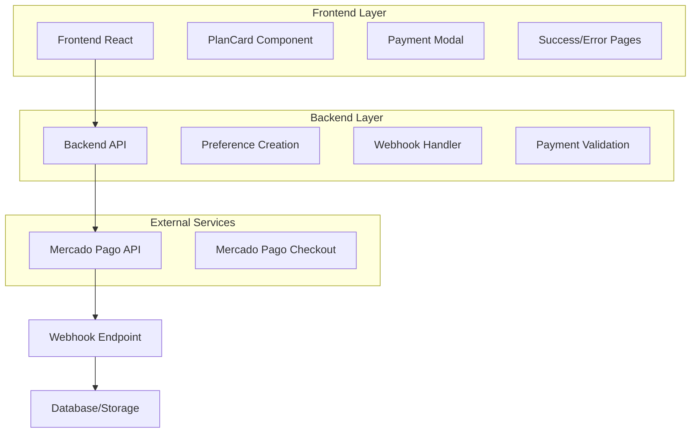
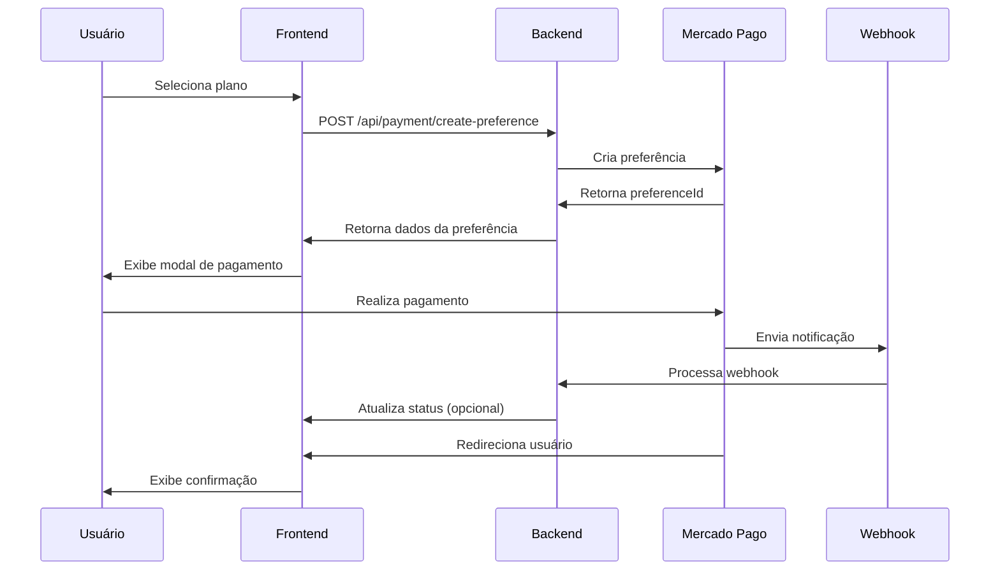

# Plano de Integração Mercado Pago Checkout Pro - OneDrip

## 1. Análise da Estrutura Atual

### 1.1 Estrutura da Pasta /plans
O projeto OneDrip possui uma estrutura bem organizada para planos:

```
src/plans/
├── PlansPage.tsx          # Página principal de planos
├── components/            # Componentes modulares
│   ├── PlanCard.tsx      # Card do plano (onde integraremos o MP)
│   ├── PlanSelector.tsx  # Seletor mensal/anual
│   ├── PlansHero.tsx     # Seção hero
│   └── ...
├── data/
│   └── content.ts        # Dados editáveis dos planos
└── index.ts
```

### 1.2 Fluxo Atual
- **Seleção de Plano**: Usuário escolhe entre mensal/anual
- **Opção VIP**: Upgrade opcional
- **Ação Atual**: Redirecionamento para WhatsApp
- **Pagamento**: Link estático do Mercado Pago

### 1.3 Pontos de Integração Identificados
- `PlanCard.tsx`: Botão de ação principal
- `PlansPage.tsx`: Lógica de seleção e confirmação
- `content.ts`: Configurações de preços e dados

## 2. Arquitetura Técnica da Integração

### 2.1 Diagrama de Arquitetura


### 2.2 Tecnologias Necessárias
- **Frontend**: React + TypeScript + Vite (já existente)
- **Backend**: Node.js + Express (novo)
- **SDK**: `mercadopago` (servidor) + `@mercadopago/sdk-react` (cliente)
- **Database**: Supabase (já existente)
- **Webhook**: Endpoint para notificações

## 3. Implementação Step-by-Step

### 3.1 Fase 1: Configuração Inicial

#### 3.1.1 Instalação de Dependências
```bash
# Frontend
npm install @mercadopago/sdk-react

# Backend (novo projeto)
npm install mercadopago express cors dotenv
npm install -D @types/express @types/cors
```

#### 3.1.2 Configuração de Credenciais
```typescript
// .env
MERCADOPAGO_ACCESS_TOKEN=your_access_token
MERCADOPAGO_PUBLIC_KEY=your_public_key
WEBHOOK_URL=https://your-domain.com/webhook
```

### 3.2 Fase 2: Backend - API de Preferências

#### 3.2.1 Estrutura do Backend
```
backend/
├── src/
│   ├── controllers/
│   │   └── PaymentController.ts
│   ├── services/
│   │   └── MercadoPagoService.ts
│   ├── routes/
│   │   └── payment.ts
│   ├── types/
│   │   └── payment.types.ts
│   └── app.ts
├── package.json
└── .env
```

#### 3.2.2 Serviço Mercado Pago
```typescript
// src/services/MercadoPagoService.ts
import { MercadoPagoConfig, Preference } from 'mercadopago';

export class MercadoPagoService {
  private client: MercadoPagoConfig;
  private preference: Preference;

  constructor() {
    this.client = new MercadoPagoConfig({
      accessToken: process.env.MERCADOPAGO_ACCESS_TOKEN!,
      options: { timeout: 5000 }
    });
    this.preference = new Preference(this.client);
  }

  async createPreference(planData: PlanData) {
    const preferenceData = {
      items: [{
        title: planData.nome,
        description: planData.descricao,
        unit_price: planData.preco,
        quantity: 1,
        currency_id: 'BRL'
      }],
      back_urls: {
        success: `${process.env.FRONTEND_URL}/payment/success`,
        failure: `${process.env.FRONTEND_URL}/payment/failure`,
        pending: `${process.env.FRONTEND_URL}/payment/pending`
      },
      auto_return: 'approved',
      notification_url: `${process.env.WEBHOOK_URL}/webhook`,
      external_reference: `plan_${planData.id}_${Date.now()}`,
      payer: {
        email: planData.userEmail
      }
    };

    return await this.preference.create({ body: preferenceData });
  }
}
```

#### 3.2.3 Controller de Pagamento
```typescript
// src/controllers/PaymentController.ts
import { Request, Response } from 'express';
import { MercadoPagoService } from '../services/MercadoPagoService';

export class PaymentController {
  private mpService: MercadoPagoService;

  constructor() {
    this.mpService = new MercadoPagoService();
  }

  async createPreference(req: Request, res: Response) {
    try {
      const { planType, billingCycle, isVip, userEmail } = req.body;
      
      const planData = this.calculatePlanData(planType, billingCycle, isVip);
      planData.userEmail = userEmail;
      
      const preference = await this.mpService.createPreference(planData);
      
      res.json({
        preferenceId: preference.id,
        initPoint: preference.init_point,
        sandboxInitPoint: preference.sandbox_init_point
      });
    } catch (error) {
      console.error('Erro ao criar preferência:', error);
      res.status(500).json({ error: 'Erro interno do servidor' });
    }
  }

  async handleWebhook(req: Request, res: Response) {
    try {
      const { type, data } = req.body;
      
      if (type === 'payment') {
        // Processar notificação de pagamento
        await this.processPaymentNotification(data.id);
      }
      
      res.status(200).send('OK');
    } catch (error) {
      console.error('Erro no webhook:', error);
      res.status(500).send('Error');
    }
  }
}
```

### 3.3 Fase 3: Frontend - Integração React

#### 3.3.1 Configuração do SDK React
```typescript
// src/config/mercadopago.ts
import { initMercadoPago } from '@mercadopago/sdk-react';

export const initializeMercadoPago = () => {
  initMercadoPago(import.meta.env.VITE_MERCADOPAGO_PUBLIC_KEY);
};
```

#### 3.3.2 Hook para Pagamentos
```typescript
// src/hooks/usePayment.ts
import { useState } from 'react';
import { PaymentData } from '../types/payment';

export const usePayment = () => {
  const [loading, setLoading] = useState(false);
  const [error, setError] = useState<string | null>(null);

  const createPaymentPreference = async (paymentData: PaymentData) => {
    setLoading(true);
    setError(null);
    
    try {
      const response = await fetch('/api/payment/create-preference', {
        method: 'POST',
        headers: {
          'Content-Type': 'application/json'
        },
        body: JSON.stringify(paymentData)
      });
      
      if (!response.ok) {
        throw new Error('Erro ao criar preferência de pagamento');
      }
      
      const data = await response.json();
      return data;
    } catch (err) {
      setError(err instanceof Error ? err.message : 'Erro desconhecido');
      throw err;
    } finally {
      setLoading(false);
    }
  };

  return { createPaymentPreference, loading, error };
};
```

#### 3.3.3 Componente de Pagamento
```typescript
// src/components/PaymentModal.tsx
import React, { useState } from 'react';
import { Wallet } from '@mercadopago/sdk-react';
import { Dialog, DialogContent, DialogHeader, DialogTitle } from '@/components/ui/dialog';
import { usePayment } from '@/hooks/usePayment';

interface PaymentModalProps {
  isOpen: boolean;
  onClose: () => void;
  planData: PlanData;
}

export const PaymentModal: React.FC<PaymentModalProps> = ({ 
  isOpen, 
  onClose, 
  planData 
}) => {
  const [preferenceId, setPreferenceId] = useState<string | null>(null);
  const { createPaymentPreference, loading } = usePayment();

  const handlePayment = async () => {
    try {
      const preference = await createPaymentPreference({
        planType: planData.nome,
        billingCycle: planData.ciclo,
        isVip: false, // Implementar lógica VIP
        userEmail: 'user@example.com' // Obter do contexto de usuário
      });
      
      setPreferenceId(preference.preferenceId);
    } catch (error) {
      console.error('Erro ao iniciar pagamento:', error);
    }
  };

  return (
    <Dialog open={isOpen} onOpenChange={onClose}>
      <DialogContent className="max-w-md">
        <DialogHeader>
          <DialogTitle>Finalizar Pagamento</DialogTitle>
        </DialogHeader>
        
        <div className="space-y-4">
          <div className="text-center">
            <h3 className="font-semibold">{planData.nome}</h3>
            <p className="text-2xl font-bold">
              {planData.moeda}{planData.preco.toFixed(2)}
              <span className="text-sm text-muted-foreground">
                {planData.periodo}
              </span>
            </p>
          </div>
          
          {preferenceId ? (
            <Wallet 
              initialization={{ preferenceId }} 
              onSubmit={async (param) => {
                console.log('Pagamento submetido:', param);
              }}
            />
          ) : (
            <button 
              onClick={handlePayment}
              disabled={loading}
              className="w-full btn-premium"
            >
              {loading ? 'Carregando...' : 'Pagar com Mercado Pago'}
            </button>
          )}
        </div>
      </DialogContent>
    </Dialog>
  );
};
```

#### 3.3.4 Atualização do PlanCard
```typescript
// src/plans/components/PlanCard.tsx (modificado)
import React, { useState } from 'react';
import { PaymentModal } from '@/components/PaymentModal';
// ... outros imports

export const PlanCard = ({ plano, aoSelecionarPlano }: PlanCardProps) => {
  const [showPaymentModal, setShowPaymentModal] = useState(false);

  const handlePaymentClick = () => {
    setShowPaymentModal(true);
  };

  return (
    <section className="animate-fade-in-up" style={{ animationDelay: '0.4s' }}>
      {/* ... conteúdo existente ... */}
      
      <Button 
        onClick={handlePaymentClick}
        className="w-full btn-premium text-lg py-4 mb-4"
      >
        {plano.botao_texto}
      </Button>
      
      <PaymentModal 
        isOpen={showPaymentModal}
        onClose={() => setShowPaymentModal(false)}
        planData={plano}
      />
      
      {/* ... resto do conteúdo ... */}
    </section>
  );
};
```

## 4. Configuração de Webhooks e Notificações

### 4.1 Endpoint de Webhook
```typescript
// src/routes/webhook.ts
import express from 'express';
import { PaymentController } from '../controllers/PaymentController';

const router = express.Router();
const paymentController = new PaymentController();

router.post('/webhook', (req, res) => {
  paymentController.handleWebhook(req, res);
});

export default router;
```

### 4.2 Processamento de Notificações
```typescript
// src/services/NotificationService.ts
import { MercadoPagoConfig, Payment } from 'mercadopago';
import { SupabaseService } from './SupabaseService';

export class NotificationService {
  private payment: Payment;
  private supabase: SupabaseService;

  constructor() {
    const client = new MercadoPagoConfig({
      accessToken: process.env.MERCADOPAGO_ACCESS_TOKEN!
    });
    this.payment = new Payment(client);
    this.supabase = new SupabaseService();
  }

  async processPaymentNotification(paymentId: string) {
    try {
      const paymentData = await this.payment.get({ id: paymentId });
      
      if (paymentData.status === 'approved') {
        await this.activateUserPlan(paymentData);
        await this.sendConfirmationEmail(paymentData);
      }
      
      // Salvar no banco de dados
      await this.supabase.savePaymentRecord(paymentData);
      
    } catch (error) {
      console.error('Erro ao processar notificação:', error);
    }
  }

  private async activateUserPlan(paymentData: any) {
    // Implementar ativação do plano do usuário
  }

  private async sendConfirmationEmail(paymentData: any) {
    // Implementar envio de email de confirmação
  }
}
```

## 5. Estrutura de Arquivos Necessários

### 5.1 Novos Arquivos Frontend
```
src/
├── components/
│   ├── PaymentModal.tsx          # Modal de pagamento
│   ├── PaymentStatus.tsx         # Status do pagamento
│   └── PaymentSuccess.tsx        # Página de sucesso
├── hooks/
│   ├── usePayment.ts            # Hook para pagamentos
│   └── useMercadoPago.ts        # Hook para MP
├── services/
│   └── paymentApi.ts            # API de pagamentos
├── types/
│   └── payment.types.ts         # Tipos TypeScript
└── config/
    └── mercadopago.ts           # Configuração MP
```

### 5.2 Backend (Novo Projeto)
```
backend/
├── src/
│   ├── controllers/
│   │   └── PaymentController.ts
│   ├── services/
│   │   ├── MercadoPagoService.ts
│   │   ├── NotificationService.ts
│   │   └── SupabaseService.ts
│   ├── routes/
│   │   ├── payment.ts
│   │   └── webhook.ts
│   ├── middleware/
│   │   ├── auth.ts
│   │   └── validation.ts
│   ├── types/
│   │   └── payment.types.ts
│   └── app.ts
├── package.json
├── .env
└── vercel.json              # Para deploy
```

## 6. Fluxo de Pagamento Completo

### 6.1 Diagrama de Fluxo


### 6.2 Estados do Pagamento
1. **Pendente**: Aguardando pagamento
2. **Processando**: Pagamento em análise
3. **Aprovado**: Pagamento confirmado
4. **Rejeitado**: Pagamento negado
5. **Cancelado**: Pagamento cancelado

## 7. Configurações de Segurança e Ambiente

### 7.1 Variáveis de Ambiente
```bash
# Frontend (.env)
VITE_MERCADOPAGO_PUBLIC_KEY=your_public_key
VITE_API_URL=http://localhost:3001

# Backend (.env)
MERCADOPAGO_ACCESS_TOKEN=your_access_token
MERCADOPAGO_PUBLIC_KEY=your_public_key
WEBHOOK_URL=https://your-domain.com
FRONTEND_URL=https://your-frontend.com
SUPABASE_URL=your_supabase_url
SUPABASE_ANON_KEY=your_supabase_key
```

### 7.2 Configurações de Segurança
```typescript
// src/middleware/security.ts
import rateLimit from 'express-rate-limit';
import helmet from 'helmet';

export const securityMiddleware = [
  helmet(),
  rateLimit({
    windowMs: 15 * 60 * 1000, // 15 minutos
    max: 100 // máximo 100 requests por IP
  })
];

// Validação de webhook
export const validateWebhook = (req: Request, res: Response, next: NextFunction) => {
  const signature = req.headers['x-signature'];
  // Implementar validação de assinatura
  next();
};
```

### 7.3 Configuração CORS
```typescript
// src/app.ts
import cors from 'cors';

app.use(cors({
  origin: process.env.FRONTEND_URL,
  credentials: true,
  methods: ['GET', 'POST', 'PUT', 'DELETE'],
  allowedHeaders: ['Content-Type', 'Authorization']
}));
```

## 8. Testes e Validação

### 8.1 Ambiente de Testes
```typescript
// tests/payment.test.ts
import { describe, it, expect } from 'vitest';
import { MercadoPagoService } from '../src/services/MercadoPagoService';

describe('MercadoPago Service', () => {
  it('should create payment preference', async () => {
    const service = new MercadoPagoService();
    const planData = {
      nome: 'Plano Teste',
      preco: 68.90,
      userEmail: 'test@example.com'
    };
    
    const preference = await service.createPreference(planData);
    expect(preference.id).toBeDefined();
    expect(preference.init_point).toBeDefined();
  });
});
```

### 8.2 Cartões de Teste
```typescript
// Cartões para ambiente sandbox
const TEST_CARDS = {
  VISA_APPROVED: '4509953566233704',
  MASTERCARD_APPROVED: '5031433215406351',
  VISA_REJECTED: '4000000000000002'
};
```

### 8.3 Checklist de Validação
- [ ] Criação de preferência funciona
- [ ] Modal de pagamento abre corretamente
- [ ] Redirecionamento para MP funciona
- [ ] Webhook recebe notificações
- [ ] Status do pagamento é atualizado
- [ ] Usuário é redirecionado após pagamento
- [ ] Emails de confirmação são enviados
- [ ] Plano é ativado automaticamente

## 9. Deploy e Configuração de Produção

### 9.1 Deploy do Backend
```json
// vercel.json
{
  "version": 2,
  "builds": [
    {
      "src": "src/app.ts",
      "use": "@vercel/node"
    }
  ],
  "routes": [
    {
      "src": "/(.*)",
      "dest": "src/app.ts"
    }
  ],
  "env": {
    "MERCADOPAGO_ACCESS_TOKEN": "@mercadopago-access-token",
    "WEBHOOK_URL": "@webhook-url"
  }
}
```

### 9.2 Configuração de Domínio
1. Configurar domínio para webhook
2. Certificado SSL obrigatório
3. Configurar URLs de retorno
4. Testar em ambiente de produção

## 10. Monitoramento e Logs

### 10.1 Sistema de Logs
```typescript
// src/utils/logger.ts
import winston from 'winston';

export const logger = winston.createLogger({
  level: 'info',
  format: winston.format.json(),
  transports: [
    new winston.transports.File({ filename: 'error.log', level: 'error' }),
    new winston.transports.File({ filename: 'combined.log' })
  ]
});
```

### 10.2 Métricas de Pagamento
- Taxa de conversão
- Pagamentos aprovados/rejeitados
- Tempo médio de processamento
- Erros de integração

## 11. Próximos Passos

### 11.1 Implementação Imediata
1. Configurar credenciais do Mercado Pago
2. Criar projeto backend
3. Implementar serviço de preferências
4. Integrar modal de pagamento
5. Configurar webhook

### 11.2 Melhorias Futuras
- Implementar múltiplos métodos de pagamento
- Sistema de cupons de desconto
- Pagamentos recorrentes automáticos
- Dashboard de analytics
- Integração com sistema de CRM

---

**Nota**: Este plano está baseado na documentação oficial do Mercado Pago e no repositório de referência fornecido. A implementação deve ser feita gradualmente, testando cada etapa antes de prosseguir para a próxima.