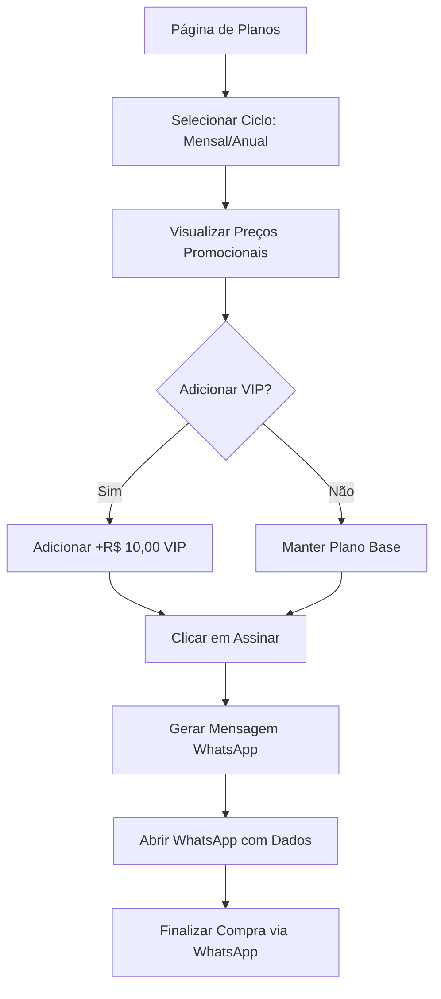
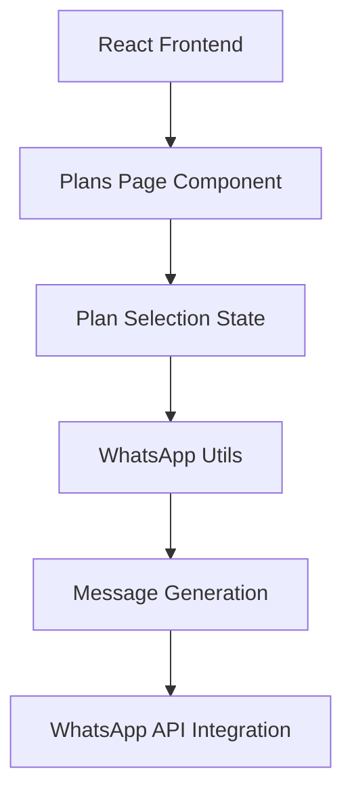

# 📋 Plano de Melhorias - Seção /plans

## 1. Visão Geral do Projeto

Este documento detalha as melhorias necessárias para a seção de planos (/plans) do sistema OneDrip, incluindo a implementação de planos mensais e anuais com preços promocionais, opção VIP adicional e integração automática com WhatsApp para processamento de pedidos.

## 2. Funcionalidades Principais

### 2.1 Estrutura de Planos

**Planos Base:**

* **Plano Mensal**: R$ 68,90/mês (de R$ 80,00)

* **Plano Anual**: R$ 638,55/ano (de R$ 800,00) - economia de 2 meses

**Opção VIP (Adicional):**

* **Custo adicional**: +R$ 10,00/mês

* **Benefícios exclusivos**: Acesso ao sistema de ordem de serviço e funcionalidades avançadas

### 2.2 Módulos da Página

Nossa página de planos melhorada consistirá dos seguintes módulos principais:

1. **Seção Hero**: Título principal, subtítulo e navegação de ciclo de cobrança
2. **Seletor de Ciclo**: Toggle entre planos mensais e anuais
3. **Cards de Planos**: Exibição dos planos base com preços promocionais
4. **Opção VIP**: Checkbox adicional para upgrade VIP
5. **Integração WhatsApp**: Envio automático de dados do plano selecionado

### 2.3 Detalhes das Páginas

| Página | Módulo              | Descrição da Funcionalidade                                |
| ------ | ------------------- | ---------------------------------------------------------- |
| Plans  | Seletor de Ciclo    | Toggle entre mensal/anual com indicação de economia        |
| Plans  | Card Plano Base     | Exibe preço original riscado e preço promocional destacado |
| Plans  | Opção VIP           | Checkbox para adicionar funcionalidades VIP por +R$ 10,00  |
| Plans  | Botão de Ação       | Gera mensagem WhatsApp com dados do plano escolhido        |
| Plans  | Integração WhatsApp | Abre WhatsApp com mensagem pré-formatada para 649996028022 |

## 3. Fluxo Principal do Usuário

O usuário navega pela página de planos, seleciona entre mensal/anual, opcionalmente adiciona o upgrade VIP, e ao clicar em "Assinar" é redirecionado para o WhatsApp com uma mensagem contendo todos os detalhes do plano escolhido para finalizar a compra.



## 4. Design da Interface

### 4.1 Estilo de Design

* **Cores primárias**: Manter paleta atual do OneDrip

* **Cores secundárias**: Verde para economia, dourado para VIP

* **Estilo de botões**: Arredondados com gradiente

* **Fontes**: Inter/System fonts, tamanhos 14px-32px

* **Layout**: Cards centralizados com grid responsivo

* **Ícones**: Lucide icons para consistência

### 4.2 Visão Geral do Design das Páginas

| Página | Módulo           | Elementos de UI                                                          |
| ------ | ---------------- | ------------------------------------------------------------------------ |
| Plans  | Seletor de Ciclo | Toggle buttons com badge "2 meses grátis" para anual                     |
| Plans  | Card de Plano    | Preço original riscado, preço promocional destacado, lista de benefícios |
| Plans  | Opção VIP        | Checkbox estilizado com ícone de coroa e descrição dos benefícios        |
| Plans  | Botão Principal  | Gradiente verde-azul, texto "Assinar Agora", ícone WhatsApp              |

### 4.3 Responsividade

O design será mobile-first com adaptação para desktop, incluindo otimizações para touch e gestos em dispositivos móveis.

## 5. Implementação Técnica

### 5.1 Arquitetura



### 5.2 Tecnologias

* Frontend: React\@18 + TypeScript + Tailwind CSS

* Estado: React useState/useEffect

* Utilitários: WhatsApp Web API integration

* Styling: Tailwind CSS com componentes customizados

### 5.3 Estrutura de Dados

```typescript
interface PlanSelection {
  cycle: 'monthly' | 'yearly';
  basePrice: number;
  originalPrice: number;
  isVip: boolean;
  vipPrice: number;
  totalPrice: number;
  features: string[];
  vipFeatures: string[];
}

interface WhatsAppMessage {
  planType: string;
  cycle: string;
  price: string;
  originalPrice: string;
  isVip: boolean;
  features: string[];
  customerData?: any;
}
```

### 5.4 Integração WhatsApp

**Número de destino**: 649996028022

**Formato da mensagem**:

```
📋 *Plano escolhido:* [Mensal/Anual]
💰 *Valor:* R$ [preço] (de R$ [preço_original])
👑 *VIP:* [Sim/Não] (+R$ 10,00)
💳 *Total:* R$ [total]

✅ *Benefícios inclusos:*
• [lista de benefícios]

[Se VIP]
👑 *Benefícios VIP adicionais:*
• [outros benefícios VIP]

📱 Gostaria de finalizar esta assinatura!
```

## 6. Cronograma de Implementação

### Fase 1: Estrutura Base (1-2 dias)

* Atualizar componente PlanCard para suportar múltiplos planos

* Implementar seletor de ciclo mensal/anual

* Adicionar lógica de cálculo de preços

### Fase 2: Opção VIP (1 dia)

* Criar componente VIP addon

* Implementar lógica de preços VIP

* Adicionar benefícios VIP à interface

### Fase 3: Integração WhatsApp (1 dia)

* Implementar geração de mensagem personalizada

* Integrar com WhatsApp Web API

* Testes de fluxo completo

### Fase 4: Testes e Refinamentos (1 dia)

* Testes responsivos

* Ajustes de UX/UI

* Validação do fluxo completo

## 7. Considerações de Segurança

* Validação de dados no frontend antes do envio

* Sanitização de mensagens para WhatsApp

* Prevenção de spam através de rate limiting

* Logs de ações para auditoria

## 8. Métricas de Sucesso

* Taxa de conversão de visitantes para cliques no WhatsApp

* Tempo de permanência na página de planos

* Preferência entre planos mensais vs anuais

* Adoção da opção VIP

* Feedback dos usuários sobre o processo de compra

***

**Próximos Passos:**

1. Revisar e aprovar este plano
2. Iniciar implementação seguindo as fases definidas
3. Realizar testes em ambiente de desenvolvimento
4. Deploy em produção com monitoramento ativo

