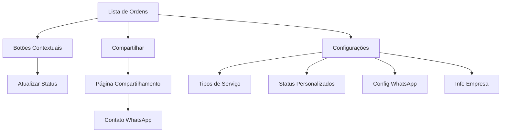

# Melhorias na Funcionalidade de Ordens de Serviço

## 1. Visão Geral do Produto

Este documento detalha as melhorias na funcionalidade de Ordens de Serviço do Sistema Oliver Blueberry, focando em otimizar o fluxo de trabalho do usuário através de gerenciamento inteligente de progresso, configurações personalizáveis, compartilhamento aprimorado via WhatsApp e personalização de marca.

O objetivo é criar uma experiência mais fluida e profissional para técnicos e clientes, aumentando a eficiência operacional e melhorando a comunicação.

## 2. Funcionalidades Principais

### 2.1 Papéis de Usuário

| Papel | Método de Registro | Permissões Principais |
|-------|-------------------|----------------------|
| Técnico | Login existente com flag VIP | Gerenciar ordens, configurar sistema, compartilhar via WhatsApp |
| Cliente | Acesso via link compartilhado | Visualizar progresso da ordem, contatar empresa |

### 2.2 Módulos de Funcionalidade

Nossas melhorias consistem nas seguintes páginas principais:

1. **Página de Ordens de Serviço**: gerenciamento de progresso contextual, botão de configurações, ações aprimoradas.
2. **Página de Configurações de OS**: personalização de tipos de serviço, status customizados, configurações de WhatsApp.
3. **Página de Compartilhamento**: visualização com marca personalizada, botão WhatsApp, informações da empresa.

### 2.3 Detalhes das Páginas

| Nome da Página | Nome do Módulo | Descrição da Funcionalidade |
|----------------|----------------|-----------------------------|
| Ordens de Serviço | Botões Contextuais de Progresso | Exibir botões dinâmicos baseados no status atual (Iniciar Serviço, Concluir, Entregar) com transições suaves |
| Ordens de Serviço | Botão de Configurações | Adicionar botão "Configurações" no header que direciona para /service-orders/settings |
| Configurações de OS | Tipos de Serviço | Gerenciar tipos de serviço personalizados (Reparo, Manutenção, Diagnóstico, etc.) |
| Configurações de OS | Status Personalizados | Configurar status customizados além dos padrões (Em Análise, Aguardando Peças, etc.) |
| Configurações de OS | Configurações WhatsApp | Definir número padrão para compartilhamento, mensagem personalizada |
| Configurações de OS | Informações da Empresa | Gerenciar logo, nome, endereço e dados de contato |
| Compartilhamento | Header com Marca | Exibir logo e nome da empresa no topo da página |
| Compartilhamento | Botão WhatsApp | Permitir contato direto via WhatsApp com número configurável |
| Compartilhamento | Informações da Empresa | Mostrar endereço, horário de funcionamento e descrição |

## 3. Processo Principal

### Fluxo do Técnico:
1. Acessa lista de ordens de serviço
2. Utiliza botões contextuais para avançar status (Aberta → Em Andamento → Concluída → Entregue)
3. Acessa configurações para personalizar tipos de serviço e status
4. Gera link de compartilhamento e envia via WhatsApp

### Fluxo do Cliente:
1. Recebe link via WhatsApp
2. Visualiza progresso da ordem com marca da empresa
3. Pode entrar em contato via WhatsApp diretamente da página



## 4. Design da Interface do Usuário

### 4.1 Estilo de Design

- **Cores Primárias**: Azul (#3B82F6) para ações principais, Verde (#10B981) para conclusão
- **Cores Secundárias**: Amarelo (#F59E0B) para progresso, Vermelho (#EF4444) para urgente
- **Estilo de Botões**: Arredondados com sombra sutil, efeito hover suave
- **Fonte**: Inter, tamanhos 14px (corpo), 16px (botões), 24px (títulos)
- **Layout**: Card-based com espaçamento consistente, navegação top-level
- **Ícones**: Lucide React com estilo outline, tamanho 16px-20px

### 4.2 Visão Geral do Design das Páginas

| Nome da Página | Nome do Módulo | Elementos da UI |
|----------------|----------------|----------------|
| Ordens de Serviço | Botões Contextuais | Botões coloridos com ícones (Wrench, CheckCircle), largura total, transições suaves |
| Ordens de Serviço | Header Aprimorado | Botão "Configurações" com ícone Settings, posicionado ao lado do botão "Nova" |
| Configurações de OS | Layout Principal | Cards organizados em grid 2x2, cada seção com ícone e descrição |
| Configurações de OS | Formulários | Inputs com labels flutuantes, selects customizados, toggle switches |
| Compartilhamento | Header com Marca | Logo 40px altura, nome empresa fonte bold 18px, fundo gradiente sutil |
| Compartilhamento | Botão WhatsApp | Verde WhatsApp (#25D366), ícone MessageCircle, texto "Entrar em Contato" |
| Compartilhamento | Timeline de Status | Círculos conectados, cores baseadas no progresso, animação de preenchimento |

### 4.3 Responsividade

Desktop-first com adaptação mobile completa. Otimização para touch em dispositivos móveis, com botões de tamanho adequado (mínimo 44px) e espaçamento generoso. Layout em coluna única no mobile com cards empilhados.

## 5. Especificações Técnicas

### 5.1 Estruturas de Dados Necessárias

**Tabelas Existentes a Utilizar:**
- `company_info`: name, logo_url, whatsapp_phone, address, business_hours
- `company_share_settings`: welcome_message, special_instructions
- `service_orders`: status, priority, device_model, reported_issue

**Novas Tabelas a Criar:**

```sql
-- Tipos de serviço personalizados
CREATE TABLE service_types (
    id UUID PRIMARY KEY DEFAULT gen_random_uuid(),
    user_id UUID REFERENCES auth.users(id),
    name VARCHAR(100) NOT NULL,
    description TEXT,
    color VARCHAR(7) DEFAULT '#3B82F6',
    icon VARCHAR(50) DEFAULT 'wrench',
    is_active BOOLEAN DEFAULT true,
    created_at TIMESTAMP WITH TIME ZONE DEFAULT NOW()
);

-- Status personalizados
CREATE TABLE custom_statuses (
    id UUID PRIMARY KEY DEFAULT gen_random_uuid(),
    user_id UUID REFERENCES auth.users(id),
    name VARCHAR(100) NOT NULL,
    description TEXT,
    color VARCHAR(7) NOT NULL,
    icon VARCHAR(50) NOT NULL,
    order_index INTEGER DEFAULT 0,
    is_active BOOLEAN DEFAULT true,
    created_at TIMESTAMP WITH TIME ZONE DEFAULT NOW()
);

-- Configurações de WhatsApp
CREATE TABLE whatsapp_settings (
    id UUID PRIMARY KEY DEFAULT gen_random_uuid(),
    user_id UUID REFERENCES auth.users(id),
    default_phone VARCHAR(20),
    default_message TEXT,
    auto_include_order_info BOOLEAN DEFAULT true,
    created_at TIMESTAMP WITH TIME ZONE DEFAULT NOW(),
    updated_at TIMESTAMP WITH TIME ZONE DEFAULT NOW()
);
```

### 5.2 Componentes a Desenvolver

1. **ContextualProgressButtons.tsx**: Botões dinâmicos baseados no status
2. **ServiceOrderSettings.tsx**: Página de configurações completa
3. **ServiceTypeManager.tsx**: Gerenciamento de tipos de serviço
4. **CustomStatusManager.tsx**: Gerenciamento de status personalizados
5. **WhatsAppSettings.tsx**: Configurações de WhatsApp
6. **CompanyBrandingSettings.tsx**: Configurações de marca
7. **EnhancedSharePage.tsx**: Página de compartilhamento aprimorada
8. **CompanyHeader.tsx**: Header com marca para compartilhamento

### 5.3 Hooks Necessários

1. **useServiceTypes.ts**: Gerenciar tipos de serviço
2. **useCustomStatuses.ts**: Gerenciar status personalizados
3. **useWhatsAppSettings.ts**: Configurações de WhatsApp
4. **useCompanyBranding.ts**: Informações de marca
5. **useContextualActions.ts**: Ações baseadas no status

### 5.4 Integrações

- **Supabase**: Todas as operações de CRUD para novas tabelas
- **WhatsApp API**: Integração via URL scheme para compartilhamento
- **Upload de Imagens**: Para logo da empresa (usar storage existente)
- **Notificações**: Toast para feedback de ações

## 6. Critérios de Aceitação

### 6.1 Gerenciamento de Progresso
- [ ] Botões aparecem dinamicamente baseados no status atual
- [ ] Transições de status funcionam corretamente
- [ ] Feedback visual imediato para ações
- [ ] Estados de loading durante atualizações

### 6.2 Configurações
- [ ] Página acessível via botão em /service-orders
- [ ] Todas as seções funcionais (tipos, status, WhatsApp, empresa)
- [ ] Validação de formulários
- [ ] Persistência de dados no Supabase

### 6.3 Compartilhamento WhatsApp
- [ ] Botão funcional na página de compartilhamento
- [ ] Número configurável via configurações
- [ ] Mensagem personalizada incluindo dados da ordem
- [ ] Abertura correta do WhatsApp

### 6.4 Personalização de Marca
- [ ] Logo exibida corretamente na página de compartilhamento
- [ ] Nome da empresa visível
- [ ] Informações de contato atualizadas
- [ ] Design responsivo em todos os dispositivos

### 6.5 Integração
- [ ] Funcionalidades integradas harmoniosamente com design existente
- [ ] Performance mantida ou melhorada
- [ ] Compatibilidade com funcionalidades existentes
- [ ] Testes em dispositivos móveis e desktop