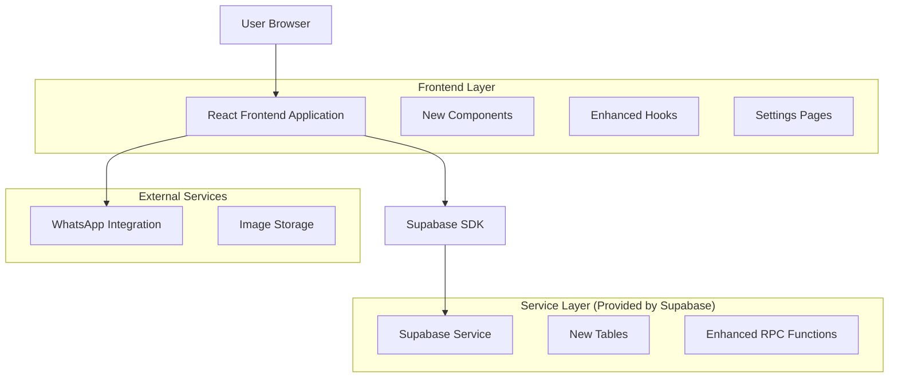
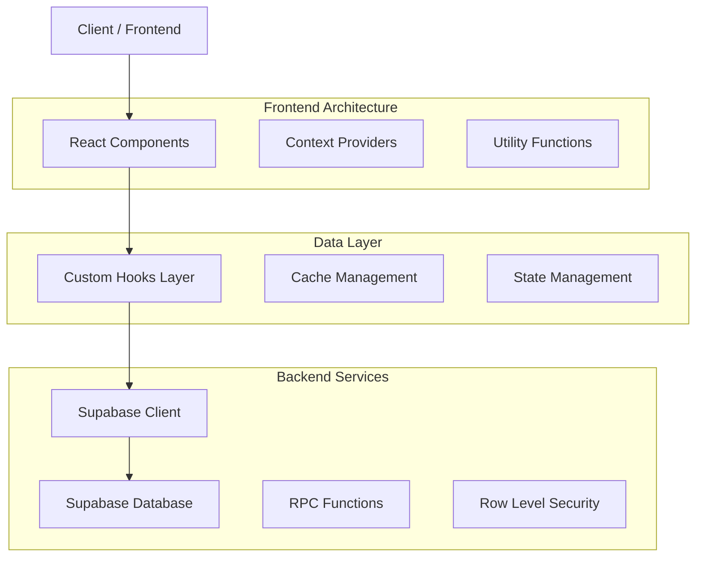
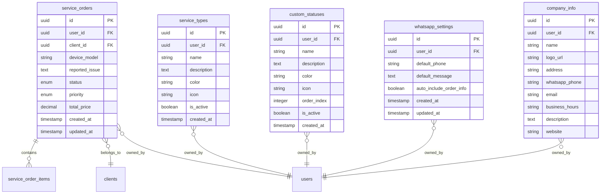

# Arquitetura Técnica - Melhorias nas Ordens de Serviço

## 1. Design da Arquitetura



## 2. Descrição da Tecnologia

- Frontend: React@18 + TypeScript + Tailwind CSS + Vite
- Backend: Supabase (PostgreSQL + Auth + Storage + RPC)
- Integração Externa: WhatsApp via URL scheme
- Upload de Imagens: Supabase Storage
- Estado: React hooks customizados + Context API

## 3. Definições de Rotas

| Rota | Propósito |
|------|----------|
| /service-orders | Página principal com botões contextuais e link para configurações |
| /service-orders/settings | Nova página de configurações de ordens de serviço |
| /service-orders/settings/types | Gerenciamento de tipos de serviço |
| /service-orders/settings/statuses | Gerenciamento de status personalizados |
| /service-orders/settings/whatsapp | Configurações de WhatsApp |
| /service-orders/settings/branding | Configurações de marca da empresa |
| /share/service-order/:token | Página de compartilhamento aprimorada com marca |

## 4. Definições de API

### 4.1 APIs Principais

**Tipos de Serviço**
```typescript
// GET /rest/v1/service_types
interface ServiceType {
  id: string;
  user_id: string;
  name: string;
  description?: string;
  color: string;
  icon: string;
  is_active: boolean;
  created_at: string;
}

// POST /rest/v1/service_types
interface CreateServiceTypeRequest {
  name: string;
  description?: string;
  color?: string;
  icon?: string;
}
```

**Status Personalizados**
```typescript
// GET /rest/v1/custom_statuses
interface CustomStatus {
  id: string;
  user_id: string;
  name: string;
  description?: string;
  color: string;
  icon: string;
  order_index: number;
  is_active: boolean;
  created_at: string;
}

// POST /rest/v1/custom_statuses
interface CreateCustomStatusRequest {
  name: string;
  description?: string;
  color: string;
  icon: string;
  order_index?: number;
}
```

**Configurações WhatsApp**
```typescript
// GET /rest/v1/whatsapp_settings
interface WhatsAppSettings {
  id: string;
  user_id: string;
  default_phone?: string;
  default_message?: string;
  auto_include_order_info: boolean;
  created_at: string;
  updated_at: string;
}

// POST /rest/v1/whatsapp_settings
interface UpdateWhatsAppSettingsRequest {
  default_phone?: string;
  default_message?: string;
  auto_include_order_info?: boolean;
}
```

**Informações da Empresa (Existente - company_info)**
```typescript
// GET /rest/v1/company_info
interface CompanyInfo {
  id: string;
  user_id: string;
  name?: string;
  logo_url?: string;
  address?: string;
  whatsapp_phone?: string;
  email?: string;
  business_hours?: string;
  description?: string;
  website?: string;
}
```

### 4.2 RPC Functions

**Atualização de Status Contextual**
```sql
CREATE OR REPLACE FUNCTION update_service_order_status_contextual(
  p_order_id UUID,
  p_new_status service_order_status,
  p_user_id UUID
)
RETURNS JSON AS $$
DECLARE
  v_current_status service_order_status;
  v_allowed_transitions TEXT[];
BEGIN
  -- Verificar status atual
  SELECT status INTO v_current_status 
  FROM service_orders 
  WHERE id = p_order_id AND user_id = p_user_id;
  
  -- Definir transições permitidas
  CASE v_current_status
    WHEN 'opened' THEN v_allowed_transitions := ARRAY['in_progress'];
    WHEN 'in_progress' THEN v_allowed_transitions := ARRAY['completed'];
    WHEN 'completed' THEN v_allowed_transitions := ARRAY['delivered'];
    ELSE v_allowed_transitions := ARRAY[]::TEXT[];
  END CASE;
  
  -- Verificar se transição é permitida
  IF p_new_status::TEXT = ANY(v_allowed_transitions) THEN
    UPDATE service_orders 
    SET status = p_new_status, updated_at = NOW()
    WHERE id = p_order_id AND user_id = p_user_id;
    
    RETURN json_build_object('success', true, 'message', 'Status atualizado com sucesso');
  ELSE
    RETURN json_build_object('success', false, 'message', 'Transição de status não permitida');
  END IF;
END;
$$ LANGUAGE plpgsql SECURITY DEFINER;
```

**Geração de Link WhatsApp**
```sql
CREATE OR REPLACE FUNCTION generate_whatsapp_share_link(
  p_order_id UUID,
  p_user_id UUID
)
RETURNS JSON AS $$
DECLARE
  v_order_info JSON;
  v_whatsapp_settings JSON;
  v_company_info JSON;
  v_message TEXT;
  v_phone TEXT;
BEGIN
  -- Buscar informações da ordem
  SELECT json_build_object(
    'id', id,
    'formatted_id', 'OS #' || RIGHT(id::TEXT, 8),
    'device_model', device_model,
    'status', status
  ) INTO v_order_info
  FROM service_orders
  WHERE id = p_order_id AND user_id = p_user_id;
  
  -- Buscar configurações WhatsApp
  SELECT json_build_object(
    'default_phone', default_phone,
    'default_message', default_message,
    'auto_include_order_info', auto_include_order_info
  ) INTO v_whatsapp_settings
  FROM whatsapp_settings
  WHERE user_id = p_user_id;
  
  -- Buscar informações da empresa
  SELECT json_build_object(
    'name', name,
    'whatsapp_phone', whatsapp_phone
  ) INTO v_company_info
  FROM company_info
  WHERE user_id = p_user_id;
  
  -- Determinar telefone e mensagem
  v_phone := COALESCE(
    v_whatsapp_settings->>'default_phone',
    v_company_info->>'whatsapp_phone',
    ''
  );
  
  v_message := COALESCE(
    v_whatsapp_settings->>'default_message',
    'Olá! Sua ordem de serviço está sendo processada.'
  );
  
  -- Incluir informações da ordem se configurado
  IF (v_whatsapp_settings->>'auto_include_order_info')::BOOLEAN THEN
    v_message := v_message || ' Ordem: ' || (v_order_info->>'formatted_id') || 
                 ' - ' || (v_order_info->>'device_model');
  END IF;
  
  RETURN json_build_object(
    'phone', v_phone,
    'message', v_message,
    'whatsapp_url', 'https://wa.me/' || REGEXP_REPLACE(v_phone, '[^0-9]', '', 'g') || 
                    '?text=' || encode(v_message::bytea, 'escape')
  );
END;
$$ LANGUAGE plpgsql SECURITY DEFINER;
```

## 5. Arquitetura do Servidor



## 6. Modelo de Dados

### 6.1 Definição do Modelo de Dados



### 6.2 Linguagem de Definição de Dados

**Tabela service_types**
```sql
CREATE TABLE service_types (
    id UUID PRIMARY KEY DEFAULT gen_random_uuid(),
    user_id UUID REFERENCES auth.users(id) ON DELETE CASCADE,
    name VARCHAR(100) NOT NULL,
    description TEXT,
    color VARCHAR(7) DEFAULT '#3B82F6',
    icon VARCHAR(50) DEFAULT 'wrench',
    is_active BOOLEAN DEFAULT true,
    created_at TIMESTAMP WITH TIME ZONE DEFAULT NOW()
);

-- Índices
CREATE INDEX idx_service_types_user_id ON service_types(user_id);
CREATE INDEX idx_service_types_active ON service_types(user_id, is_active);

-- RLS
ALTER TABLE service_types ENABLE ROW LEVEL SECURITY;

CREATE POLICY "Users can view own service types" ON service_types
    FOR SELECT USING (auth.uid() = user_id);

CREATE POLICY "Users can insert own service types" ON service_types
    FOR INSERT WITH CHECK (auth.uid() = user_id);

CREATE POLICY "Users can update own service types" ON service_types
    FOR UPDATE USING (auth.uid() = user_id);

CREATE POLICY "Users can delete own service types" ON service_types
    FOR DELETE USING (auth.uid() = user_id);

-- Dados iniciais
INSERT INTO service_types (user_id, name, description, color, icon) VALUES
(auth.uid(), 'Reparo', 'Serviços de reparo geral', '#3B82F6', 'wrench'),
(auth.uid(), 'Manutenção', 'Manutenção preventiva', '#10B981', 'settings'),
(auth.uid(), 'Diagnóstico', 'Análise e diagnóstico', '#F59E0B', 'search'),
(auth.uid(), 'Instalação', 'Instalação de componentes', '#8B5CF6', 'plus-circle');
```

**Tabela custom_statuses**
```sql
CREATE TABLE custom_statuses (
    id UUID PRIMARY KEY DEFAULT gen_random_uuid(),
    user_id UUID REFERENCES auth.users(id) ON DELETE CASCADE,
    name VARCHAR(100) NOT NULL,
    description TEXT,
    color VARCHAR(7) NOT NULL,
    icon VARCHAR(50) NOT NULL,
    order_index INTEGER DEFAULT 0,
    is_active BOOLEAN DEFAULT true,
    created_at TIMESTAMP WITH TIME ZONE DEFAULT NOW()
);

-- Índices
CREATE INDEX idx_custom_statuses_user_id ON custom_statuses(user_id);
CREATE INDEX idx_custom_statuses_order ON custom_statuses(user_id, order_index);

-- RLS
ALTER TABLE custom_statuses ENABLE ROW LEVEL SECURITY;

CREATE POLICY "Users can manage own custom statuses" ON custom_statuses
    FOR ALL USING (auth.uid() = user_id);

-- Dados iniciais
INSERT INTO custom_statuses (user_id, name, description, color, icon, order_index) VALUES
(auth.uid(), 'Em Análise', 'Analisando o problema', '#F59E0B', 'search', 1),
(auth.uid(), 'Aguardando Peças', 'Esperando chegada de componentes', '#EF4444', 'clock', 2),
(auth.uid(), 'Teste Final', 'Realizando testes finais', '#8B5CF6', 'check-circle', 3);
```

**Tabela whatsapp_settings**
```sql
CREATE TABLE whatsapp_settings (
    id UUID PRIMARY KEY DEFAULT gen_random_uuid(),
    user_id UUID REFERENCES auth.users(id) ON DELETE CASCADE,
    default_phone VARCHAR(20),
    default_message TEXT DEFAULT 'Olá! Sua ordem de serviço está sendo processada. Acompanhe o progresso através deste link.',
    auto_include_order_info BOOLEAN DEFAULT true,
    created_at TIMESTAMP WITH TIME ZONE DEFAULT NOW(),
    updated_at TIMESTAMP WITH TIME ZONE DEFAULT NOW()
);

-- Índices
CREATE INDEX idx_whatsapp_settings_user_id ON whatsapp_settings(user_id);

-- RLS
ALTER TABLE whatsapp_settings ENABLE ROW LEVEL SECURITY;

CREATE POLICY "Users can manage own whatsapp settings" ON whatsapp_settings
    FOR ALL USING (auth.uid() = user_id);

-- Trigger para updated_at
CREATE OR REPLACE FUNCTION update_updated_at_column()
RETURNS TRIGGER AS $$
BEGIN
    NEW.updated_at = NOW();
    RETURN NEW;
END;
$$ LANGUAGE plpgsql;

CREATE TRIGGER update_whatsapp_settings_updated_at
    BEFORE UPDATE ON whatsapp_settings
    FOR EACH ROW
    EXECUTE FUNCTION update_updated_at_column();
```

**Permissões para tabelas existentes**
```sql
-- Garantir acesso às tabelas existentes
GRANT SELECT ON company_info TO authenticated;
GRANT ALL PRIVILEGES ON company_info TO authenticated;

GRANT SELECT ON company_share_settings TO authenticated;
GRANT ALL PRIVILEGES ON company_share_settings TO authenticated;

GRANT SELECT ON service_orders TO authenticated;
GRANT ALL PRIVILEGES ON service_orders TO authenticated;
```

## 7. Componentes de Implementação

### 7.1 Hooks Customizados

```typescript
// useServiceTypes.ts
export const useServiceTypes = () => {
  const { user } = useAuth();
  
  const {
    data: serviceTypes,
    isLoading,
    error,
    mutate
  } = useSWR(
    user ? ['service_types', user.id] : null,
    () => supabase
      .from('service_types')
      .select('*')
      .eq('user_id', user.id)
      .eq('is_active', true)
      .order('name')
  );
  
  const createServiceType = async (data: CreateServiceTypeRequest) => {
    const { error } = await supabase
      .from('service_types')
      .insert({ ...data, user_id: user.id });
    
    if (!error) mutate();
    return { error };
  };
  
  return {
    serviceTypes: serviceTypes?.data || [],
    isLoading,
    error,
    createServiceType,
    // ... outras funções
  };
};
```

### 7.2 Componentes Principais

```typescript
// ContextualProgressButtons.tsx
interface ContextualProgressButtonsProps {
  currentStatus: ServiceOrderStatus;
  orderId: string;
  onStatusUpdate: (newStatus: ServiceOrderStatus) => void;
  isUpdating: boolean;
}

export const ContextualProgressButtons: React.FC<ContextualProgressButtonsProps> = ({
  currentStatus,
  orderId,
  onStatusUpdate,
  isUpdating
}) => {
  const getNextAction = () => {
    switch (currentStatus) {
      case 'opened':
        return {
          status: 'in_progress' as const,
          label: 'Iniciar Serviço',
          icon: Wrench,
          color: 'bg-blue-600 hover:bg-blue-700'
        };
      case 'in_progress':
        return {
          status: 'completed' as const,
          label: 'Concluir Serviço',
          icon: CheckCircle,
          color: 'bg-green-600 hover:bg-green-700'
        };
      case 'completed':
        return {
          status: 'delivered' as const,
          label: 'Marcar como Entregue',
          icon: Package,
          color: 'bg-purple-600 hover:bg-purple-700'
        };
      default:
        return null;
    }
  };
  
  const nextAction = getNextAction();
  
  if (!nextAction) return null;
  
  const { status, label, icon: Icon, color } = nextAction;
  
  return (
    <Button
      className={`w-full ${color} text-white transition-all duration-200`}
      onClick={() => onStatusUpdate(status)}
      disabled={isUpdating}
    >
      <Icon className="h-4 w-4 mr-2" />
      {isUpdating ? 'Atualizando...' : label}
    </Button>
  );
};
```

## 8. Plano de Implementação

### Fase 1: Estrutura de Dados (1-2 dias)
1. Criar novas tabelas no Supabase
2. Configurar RLS e permissões
3. Inserir dados iniciais
4. Testar queries básicas

### Fase 2: Hooks e Utilitários (2-3 dias)
1. Desenvolver hooks customizados
2. Criar funções utilitárias
3. Implementar cache e otimizações
4. Testes unitários dos hooks

### Fase 3: Componentes Base (3-4 dias)
1. Botões contextuais de progresso
2. Componentes de configuração
3. Header com marca para compartilhamento
4. Integração WhatsApp

### Fase 4: Páginas e Integração (2-3 dias)
1. Página de configurações
2. Aprimoramento da página de compartilhamento
3. Integração com páginas existentes
4. Testes de integração

### Fase 5: Testes e Refinamentos (1-2 dias)
1. Testes em dispositivos móveis
2. Otimizações de performance
3. Ajustes de UX/UI
4. Documentação final

**Total estimado: 9-14 dias de desenvolvimento**