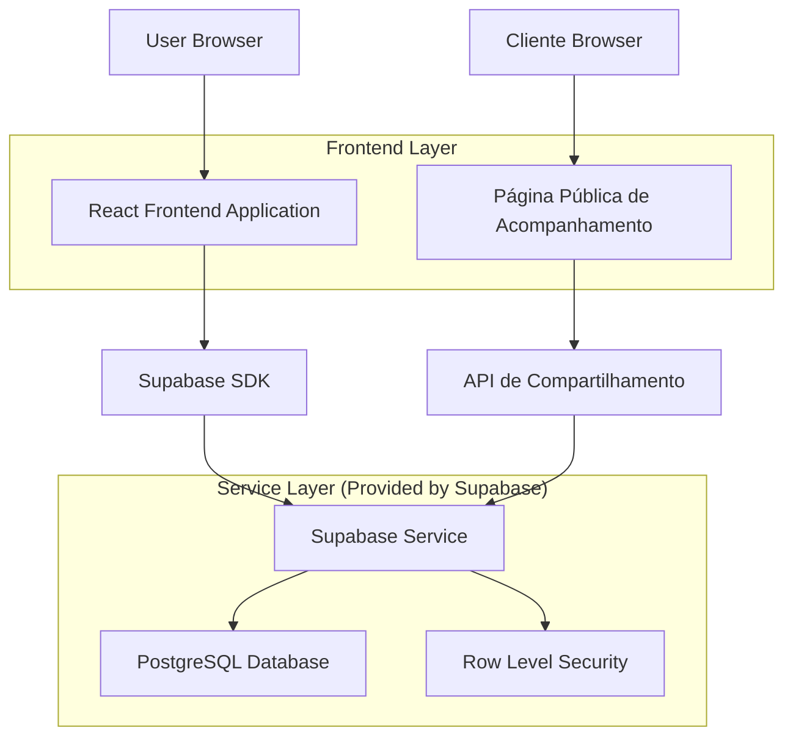
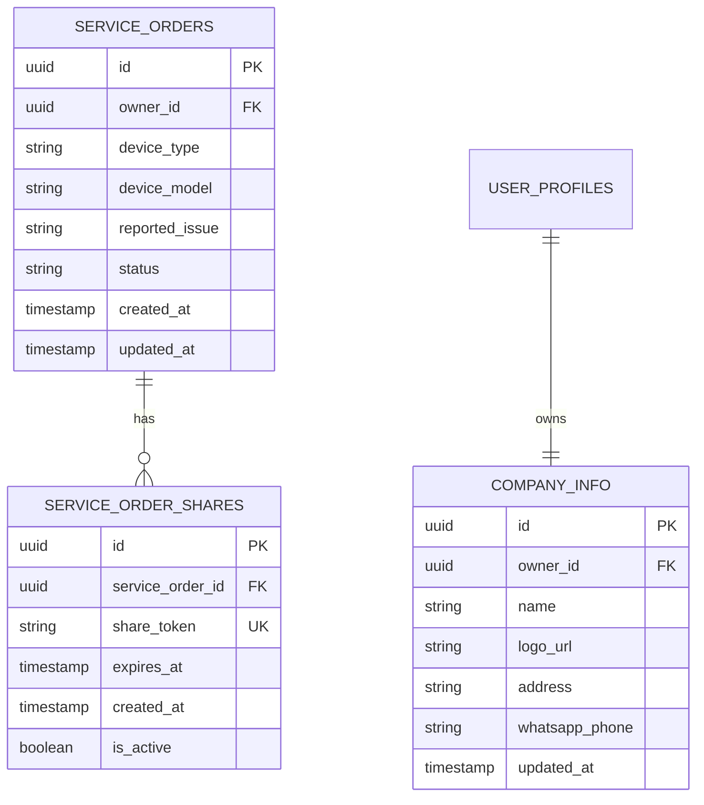

# Arquitetura Técnica - Compartilhamento de Status de Ordens de Serviço VIP

## 1. Architecture design



## 2. Technology Description

* Frontend: React\@18 + TypeScript + Tailwind CSS + Vite

* Backend: Supabase (PostgreSQL + Auth + RLS)

* Roteamento: React Router v6

* UI Components: Shadcn/ui + Lucide React

* Estado: React Hooks + Context API

## 3. Route definitions

| Route                            | Purpose                                                  |
| -------------------------------- | -------------------------------------------------------- |
| /service-orders                  | Página principal de OS VIP com botão de compartilhamento |
| /share/service-order/:shareToken | Página pública de acompanhamento acessível via token     |
| /service-orders/:id              | Página de detalhes da OS (existente)                     |
| /service-orders/:id/edit         | Página de edição da OS (existente)                       |

## 4. API definitions

### 4.1 Core API

**Geração de Token de Compartilhamento**

```
POST /rest/v1/rpc/generate_service_order_share_token
```

Request:

| Param Name         | Param Type | isRequired | Description            |
| ------------------ | ---------- | ---------- | ---------------------- |
| service\_order\_id | uuid       | true       | ID da ordem de serviço |

Response:

| Param Name   | Param Type | Description                        |
| ------------ | ---------- | ---------------------------------- |
| share\_token | string     | Token único para compartilhamento  |
| share\_url   | string     | URL completa para compartilhamento |
| expires\_at  | timestamp  | Data de expiração do token         |

Example:

```json
{
  "share_token": "5e77e3f3-a1b2-4c5d-8e9f-123456789abc",
  "share_url": "https://kuky.pro/share/service-order/5e77e3f3-a1b2-4c5d-8e9f-123456789abc",
  "expires_at": "2024-02-15T23:59:59Z"
}
```

**Obter Dados da OS via Token**

```
GET /rest/v1/rpc/get_service_order_by_share_token
```

Request:

| Param Name   | Param Type | isRequired | Description               |
| ------------ | ---------- | ---------- | ------------------------- |
| share\_token | string     | true       | Token de compartilhamento |

Response:

| Param Name      | Param Type | Description                  |
| --------------- | ---------- | ---------------------------- |
| id              | uuid       | ID da ordem de serviço       |
| formatted\_id   | string     | ID formatado (OS: #5e77e3f3) |
| device\_type    | string     | Tipo do dispositivo          |
| device\_model   | string     | Modelo do dispositivo        |
| reported\_issue | string     | Problema reportado           |
| status          | string     | Status atual                 |
| created\_at     | timestamp  | Data de criação              |
| updated\_at     | timestamp  | Última atualização           |
| company\_info   | object     | Informações da empresa       |

**Obter Informações da Empresa**

```
GET /rest/v1/rpc/get_company_info
```

Response:

| Param Name      | Param Type | Description       |
| --------------- | ---------- | ----------------- |
| name            | string     | Nome da empresa   |
| logo\_url       | string     | URL do logotipo   |
| address         | string     | Endereço completo |
| whatsapp\_phone | string     | Telefone WhatsApp |

## 5. Data model

### 5.1 Data model definition



### 5.2 Data Definition Language

**Tabela de Compartilhamentos**

```sql
-- Criar tabela para tokens de compartilhamento
CREATE TABLE service_order_shares (
    id UUID PRIMARY KEY DEFAULT gen_random_uuid(),
    service_order_id UUID NOT NULL REFERENCES service_orders(id) ON DELETE CASCADE,
    share_token VARCHAR(255) UNIQUE NOT NULL DEFAULT gen_random_uuid()::text,
    expires_at TIMESTAMP WITH TIME ZONE DEFAULT (NOW() + INTERVAL '30 days'),
    is_active BOOLEAN DEFAULT true,
    created_at TIMESTAMP WITH TIME ZONE DEFAULT NOW(),
    updated_at TIMESTAMP WITH TIME ZONE DEFAULT NOW()
);

-- Índices para performance
CREATE INDEX idx_service_order_shares_token ON service_order_shares(share_token);
CREATE INDEX idx_service_order_shares_service_order_id ON service_order_shares(service_order_id);
CREATE INDEX idx_service_order_shares_expires_at ON service_order_shares(expires_at);

-- Trigger para updated_at
CREATE TRIGGER update_service_order_shares_updated_at
    BEFORE UPDATE ON service_order_shares
    FOR EACH ROW
    EXECUTE FUNCTION update_updated_at_column();
```

**Tabela de Informações da Empresa**

```sql
-- Criar tabela para informações da empresa
CREATE TABLE company_info (
    id UUID PRIMARY KEY DEFAULT gen_random_uuid(),
    owner_id UUID NOT NULL REFERENCES user_profiles(id) ON DELETE CASCADE,
    name VARCHAR(255) NOT NULL DEFAULT 'Oliver Blueberry',
    logo_url TEXT,
    address TEXT,
    whatsapp_phone VARCHAR(20),
    created_at TIMESTAMP WITH TIME ZONE DEFAULT NOW(),
    updated_at TIMESTAMP WITH TIME ZONE DEFAULT NOW(),
    UNIQUE(owner_id)
);

-- Trigger para updated_at
CREATE TRIGGER update_company_info_updated_at
    BEFORE UPDATE ON company_info
    FOR EACH ROW
    EXECUTE FUNCTION update_updated_at_column();
```

**Funções RPC**

```sql
-- Função para gerar token de compartilhamento
CREATE OR REPLACE FUNCTION generate_service_order_share_token(
    p_service_order_id UUID
)
RETURNS TABLE (
    share_token TEXT,
    share_url TEXT,
    expires_at TIMESTAMP WITH TIME ZONE
)
SECURITY DEFINER
AS $$
DECLARE
    v_token TEXT;
    v_expires_at TIMESTAMP WITH TIME ZONE;
    v_base_url TEXT := 'https://kuky.pro';
BEGIN
    -- Verificar se o usuário tem acesso à OS
    IF NOT EXISTS (
        SELECT 1 FROM service_orders 
        WHERE id = p_service_order_id 
        AND owner_id = auth.uid()
        AND deleted_at IS NULL
    ) THEN
        RAISE EXCEPTION 'Ordem de serviço não encontrada ou sem permissão';
    END IF;
    
    -- Desativar tokens existentes
    UPDATE service_order_shares 
    SET is_active = false 
    WHERE service_order_id = p_service_order_id;
    
    -- Criar novo token
    INSERT INTO service_order_shares (service_order_id)
    VALUES (p_service_order_id)
    RETURNING share_token, expires_at INTO v_token, v_expires_at;
    
    RETURN QUERY SELECT 
        v_token,
        v_base_url || '/share/service-order/' || v_token,
        v_expires_at;
END;
$$ LANGUAGE plpgsql;

-- Função para obter OS via token
CREATE OR REPLACE FUNCTION get_service_order_by_share_token(
    p_share_token TEXT
)
RETURNS TABLE (
    id UUID,
    formatted_id TEXT,
    device_type VARCHAR,
    device_model VARCHAR,
    reported_issue TEXT,
    status VARCHAR,
    created_at TIMESTAMP WITH TIME ZONE,
    updated_at TIMESTAMP WITH TIME ZONE
)
SECURITY DEFINER
AS $$
BEGIN
    -- Verificar se o token é válido
    IF NOT EXISTS (
        SELECT 1 FROM service_order_shares 
        WHERE share_token = p_share_token 
        AND is_active = true 
        AND expires_at > NOW()
    ) THEN
        RAISE EXCEPTION 'Token inválido ou expirado';
    END IF;
    
    RETURN QUERY
    SELECT 
        so.id,
        'OS: #' || SUBSTRING(so.id::text, 1, 8) as formatted_id,
        so.device_type,
        so.device_model,
        so.reported_issue,
        so.status,
        so.created_at,
        so.updated_at
    FROM service_orders so
    INNER JOIN service_order_shares sos ON so.id = sos.service_order_id
    WHERE sos.share_token = p_share_token
    AND sos.is_active = true
    AND sos.expires_at > NOW()
    AND so.deleted_at IS NULL;
END;
$$ LANGUAGE plpgsql;

-- Função para obter informações da empresa
CREATE OR REPLACE FUNCTION get_company_info(
    p_owner_id UUID DEFAULT NULL
)
RETURNS TABLE (
    name VARCHAR,
    logo_url TEXT,
    address TEXT,
    whatsapp_phone VARCHAR
)
SECURITY DEFINER
AS $$
BEGIN
    RETURN QUERY
    SELECT 
        COALESCE(ci.name, 'Oliver Blueberry') as name,
        ci.logo_url,
        ci.address,
        ci.whatsapp_phone
    FROM company_info ci
    WHERE ci.owner_id = COALESCE(p_owner_id, auth.uid())
    UNION ALL
    SELECT 
        'Oliver Blueberry'::VARCHAR,
        NULL::TEXT,
        NULL::TEXT,
        NULL::VARCHAR
    WHERE NOT EXISTS (
        SELECT 1 FROM company_info 
        WHERE owner_id = COALESCE(p_owner_id, auth.uid())
    )
    LIMIT 1;
END;
$$ LANGUAGE plpgsql;
```

**Políticas RLS**

```sql
-- RLS para service_order_shares
ALTER TABLE service_order_shares ENABLE ROW LEVEL SECURITY;

CREATE POLICY "Users can manage their own service order shares" ON service_order_shares
    FOR ALL USING (
        EXISTS (
            SELECT 1 FROM service_orders 
            WHERE id = service_order_id 
            AND owner_id = auth.uid()
        )
    );

-- RLS para company_info
ALTER TABLE company_info ENABLE ROW LEVEL SECURITY;

CREATE POLICY "Users can manage their own company info" ON company_info
    FOR ALL USING (owner_id = auth.uid());
```

