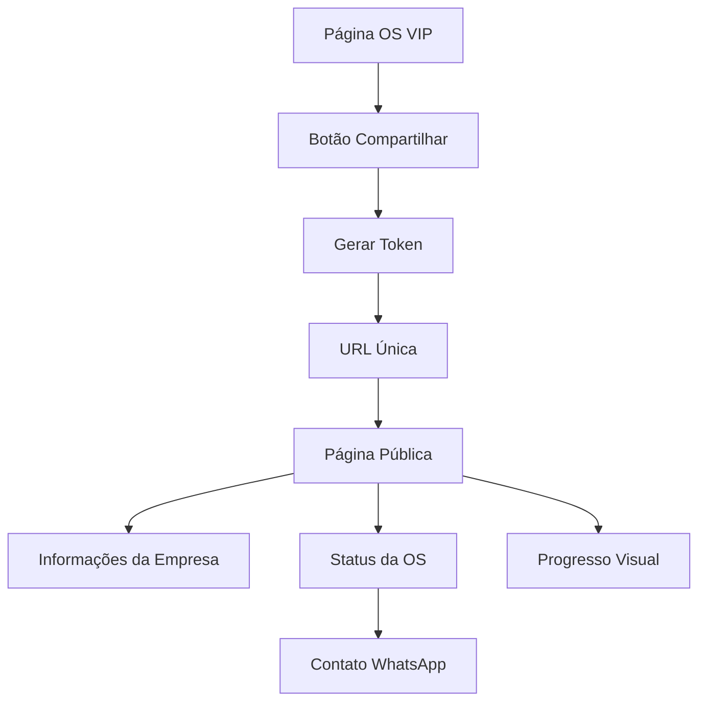

# PRD - Compartilhamento de Status de Ordens de Serviço VIP

## 1. Product Overview

Funcionalidade de compartilhamento de status para Ordens de Serviço VIP que permite aos clientes acompanhar o progresso de seus reparos em tempo real através de URLs únicas e seguras.

Esta funcionalidade resolve o problema de comunicação entre a empresa e o cliente, oferecendo transparência no processo de reparo e reduzindo a necessidade de contatos telefônicos para consultas de status.

O objetivo é aumentar a satisfação do cliente e profissionalizar o atendimento através de uma interface moderna e informativa.

## 2. Core Features

### 2.1 User Roles

| Role | Registration Method | Core Permissions |
|------|---------------------|------------------|
| Técnico/Admin | Login no sistema | Pode gerar links de compartilhamento, visualizar todas as OS |
| Cliente | Acesso via URL única | Pode visualizar apenas o status da OS específica |

### 2.2 Feature Module

Nossa funcionalidade de compartilhamento de OS VIP consiste nas seguintes páginas principais:

1. **Página de Ordens de Serviço VIP**: botão de compartilhamento, geração de URL única
2. **Página Pública de Acompanhamento**: visualização do status, informações da empresa, progresso visual
3. **Sistema de Tokens**: geração e validação de tokens seguros

### 2.3 Page Details

| Page Name | Module Name | Feature description |
|-----------|-------------|---------------------|
| Ordens de Serviço VIP | Botão de Compartilhamento | Gerar URL única para compartilhamento, copiar link para área de transferência, validar permissões de acesso |
| Página Pública de Acompanhamento | Header da Empresa | Exibir logotipo, nome da empresa, endereço e telefone WhatsApp de forma profissional |
| Página Pública de Acompanhamento | Informações da OS | Mostrar ID padronizado (OS: #5e77e3f3), status atual, data de criação, dispositivo e problema reportado |
| Página Pública de Acompanhamento | Progresso Visual | Timeline visual do status (Aberta → Em Andamento → Concluída → Entregue) com indicadores coloridos |
| Sistema de Tokens | Geração de Token | Criar token único e seguro para cada OS, definir expiração, associar ao ID da ordem |
| Sistema de Tokens | Validação de Token | Verificar validade do token, permissões de acesso, status ativo da OS |

## 3. Core Process

**Fluxo do Técnico/Admin:**
1. Acessa a página de Ordens de Serviço VIP
2. Seleciona uma ordem de serviço ativa
3. Clica no botão "Compartilhar Status"
4. Sistema gera URL única com token seguro
5. Copia o link e compartilha com o cliente

**Fluxo do Cliente:**
1. Recebe URL única via WhatsApp/SMS/Email
2. Acessa a página pública de acompanhamento
3. Visualiza informações da empresa e status da OS
4. Acompanha progresso em tempo real
5. Pode entrar em contato via WhatsApp se necessário

## 4. User Interface Design

### 4.1 Design Style

- **Cores primárias**: Azul (#3B82F6) para elementos principais, Verde (#10B981) para status concluído
- **Cores secundárias**: Cinza (#6B7280) para textos secundários, Amarelo (#F59E0B) para status em andamento
- **Estilo de botões**: Arredondados (8px border-radius) com sombras sutis
- **Fontes**: Inter para títulos (16-24px), sistema para textos (14-16px)
- **Layout**: Card-based com espaçamento generoso, design mobile-first
- **Ícones**: Lucide React com estilo outline, tamanho 20-24px

### 4.2 Page Design Overview

| Page Name | Module Name | UI Elements |
|-----------|-------------|-------------|
| Ordens de Serviço VIP | Botão de Compartilhamento | Ícone de compartilhamento (Share), cor azul primária, posicionado no menu de ações do card |
| Página Pública | Header da Empresa | Logo centralizado (max 120px), nome em fonte bold 24px, endereço e telefone em cards separados |
| Página Pública | Status da OS | Card principal com ID em destaque, badge colorido para status, timeline horizontal responsiva |
| Página Pública | Progresso Visual | Círculos conectados por linha, cores: cinza (pendente), azul (atual), verde (concluído) |

### 4.3 Responsiveness

Design mobile-first com adaptação para desktop. A página pública é otimizada para visualização em smartphones, com layout em coluna única e elementos touch-friendly. No desktop, utiliza layout em duas colunas com sidebar para informações da empresa.