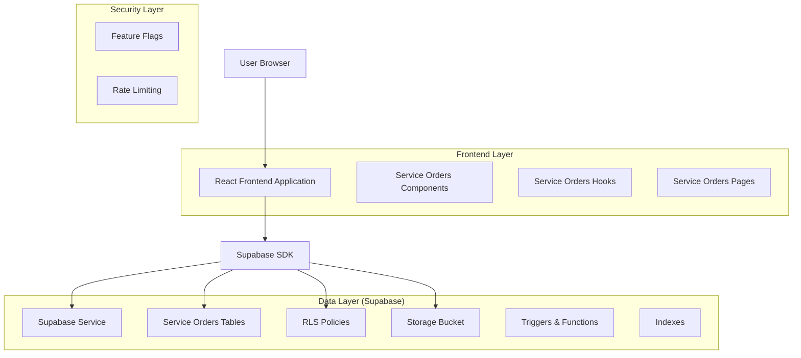
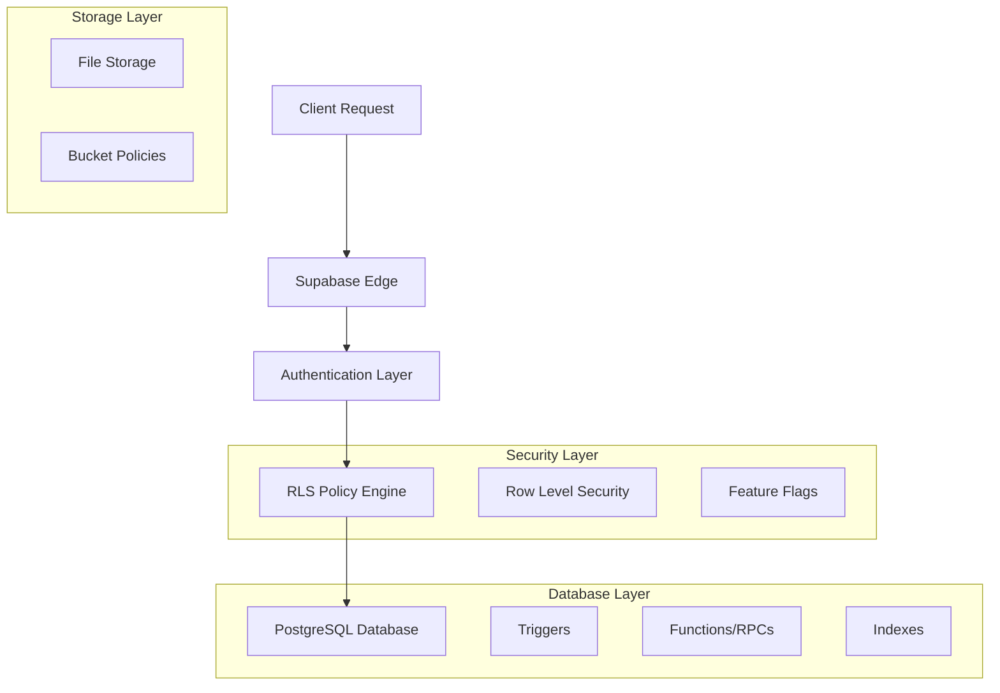
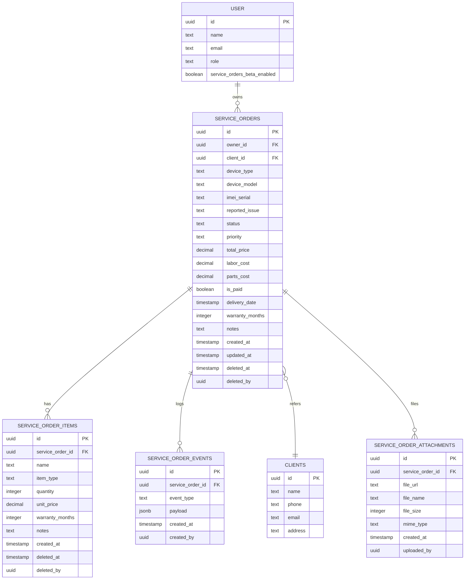

# Módulo Ordens de Serviço (Beta) - Documentação de Arquitetura Técnica

## 1. Design da Arquitetura



## 2. Descrição das Tecnologias

* Frontend: React\@18 + TypeScript + shadcn/ui + TailwindCSS + Vite

* Backend: Supabase (PostgreSQL + Auth + Storage + Edge Functions)

* State Management: TanStack Query\@5 para cache e sincronização

* Validação: Zod para schemas e validação de dados

* PDF Generation: jsPDF + pdf-lib (já existente no projeto)

## 3. Definições de Rotas

| Rota              | Propósito                                         |
| ----------------- | ------------------------------------------------- |
| /os               | Página principal de listagem de ordens de serviço |
| /os/nova          | Formulário para criar nova ordem de serviço       |
| /os/:id           | Página de detalhes de uma ordem específica        |
| /os/:id/editar    | Formulário de edição de ordem existente           |
| /os/configuracoes | Configurações e ativação da feature flag beta     |

## 4. Definições da API (Supabase)

### 4.1 Core API - Tabelas Principais

**Tabela: service\_orders**

```sql
CREATE TABLE service_orders (
    id UUID PRIMARY KEY DEFAULT gen_random_uuid(),
    owner_id UUID DEFAULT auth.uid() NOT NULL,
    client_id UUID REFERENCES clients(id),
    device_type VARCHAR(100) NOT NULL,
    device_model VARCHAR(100) NOT NULL,
    imei_serial VARCHAR(50),
    reported_issue TEXT NOT NULL,
    status VARCHAR(20) DEFAULT 'opened' CHECK (status IN ('opened', 'in_progress', 'completed', 'delivered')),
    priority VARCHAR(10) DEFAULT 'medium' CHECK (priority IN ('low', 'medium', 'high', 'urgent')),
    total_price DECIMAL(10,2) DEFAULT 0,
    labor_cost DECIMAL(10,2) DEFAULT 0,
    parts_cost DECIMAL(10,2) DEFAULT 0,
    is_paid BOOLEAN DEFAULT false,
    delivery_date TIMESTAMP WITH TIME ZONE,
    warranty_months INTEGER DEFAULT 3,
    notes TEXT,
    created_at TIMESTAMP WITH TIME ZONE DEFAULT NOW(),
    updated_at TIMESTAMP WITH TIME ZONE DEFAULT NOW(),
    deleted_at TIMESTAMP WITH TIME ZONE,
    deleted_by UUID
);
```

**Tabela: service\_order\_items**

```sql
CREATE TABLE service_order_items (
    id UUID PRIMARY KEY DEFAULT gen_random_uuid(),
    service_order_id UUID REFERENCES service_orders(id) ON DELETE CASCADE,
    name VARCHAR(200) NOT NULL,
    item_type VARCHAR(10) CHECK (item_type IN ('part', 'labor')),
    quantity INTEGER DEFAULT 1,
    unit_price DECIMAL(10,2) NOT NULL,
    warranty_months INTEGER DEFAULT 3,
    notes TEXT,
    created_at TIMESTAMP WITH TIME ZONE DEFAULT NOW(),
    deleted_at TIMESTAMP WITH TIME ZONE,
    deleted_by UUID
);
```

**Tabela: service\_order\_events**

```sql
CREATE TABLE service_order_events (
    id UUID PRIMARY KEY DEFAULT gen_random_uuid(),
    service_order_id UUID REFERENCES service_orders(id) ON DELETE CASCADE,
    event_type VARCHAR(50) NOT NULL,
    payload JSONB,
    created_at TIMESTAMP WITH TIME ZONE DEFAULT NOW(),
    created_by UUID DEFAULT auth.uid()
);
```

**Tabela: service\_order\_attachments**

```sql
CREATE TABLE service_order_attachments (
    id UUID PRIMARY KEY DEFAULT gen_random_uuid(),
    service_order_id UUID REFERENCES service_orders(id) ON DELETE CASCADE,
    file_url TEXT NOT NULL,
    file_name VARCHAR(255) NOT NULL,
    file_size INTEGER,
    mime_type VARCHAR(100),
    created_at TIMESTAMP WITH TIME ZONE DEFAULT NOW(),
    uploaded_by UUID DEFAULT auth.uid()
);
```

### 4.2 Feature Flag

**Alteração na tabela user\_profiles:**

```sql
ALTER TABLE user_profiles 
ADD COLUMN service_orders_beta_enabled BOOLEAN DEFAULT false;
```

### 4.3 RPCs (Remote Procedure Calls)

**Busca Otimizada de Ordens de Serviço:**

```sql
CREATE OR REPLACE FUNCTION get_optimized_service_orders(
    p_user_id UUID DEFAULT auth.uid(),
    p_search TEXT DEFAULT NULL,
    p_status TEXT DEFAULT NULL,
    p_priority TEXT DEFAULT NULL,
    p_limit INTEGER DEFAULT 20,
    p_offset INTEGER DEFAULT 0
)
RETURNS TABLE(
    id UUID,
    client_name TEXT,
    device_info TEXT,
    status TEXT,
    priority TEXT,
    total_price DECIMAL,
    is_paid BOOLEAN,
    created_at TIMESTAMP WITH TIME ZONE
)
LANGUAGE plpgsql
SECURITY DEFINER
AS $$
BEGIN
    RETURN QUERY
    SELECT 
        so.id,
        COALESCE(c.name, 'Cliente não informado') as client_name,
        CONCAT(so.device_type, ' ', so.device_model) as device_info,
        so.status,
        so.priority,
        so.total_price,
        so.is_paid,
        so.created_at
    FROM service_orders so
    LEFT JOIN clients c ON so.client_id = c.id
    WHERE 
        (so.owner_id = p_user_id OR public.is_current_user_admin())
        AND so.deleted_at IS NULL
        AND (p_search IS NULL OR (
            c.name ILIKE '%' || p_search || '%' OR
            so.device_model ILIKE '%' || p_search || '%' OR
            so.imei_serial ILIKE '%' || p_search || '%'
        ))
        AND (p_status IS NULL OR so.status = p_status)
        AND (p_priority IS NULL OR so.priority = p_priority)
    ORDER BY so.created_at DESC
    LIMIT p_limit OFFSET p_offset;
END;
$$;
```

**Soft Delete com Auditoria:**

```sql
CREATE OR REPLACE FUNCTION soft_delete_service_order_with_audit(
    p_order_id UUID,
    p_reason TEXT DEFAULT NULL
)
RETURNS BOOLEAN
LANGUAGE plpgsql
SECURITY DEFINER
AS $$
DECLARE
    order_owner UUID;
BEGIN
    -- Verificar se a ordem existe e pertence ao usuário
    SELECT owner_id INTO order_owner
    FROM service_orders
    WHERE id = p_order_id AND deleted_at IS NULL;
    
    IF order_owner IS NULL THEN
        RAISE EXCEPTION 'Ordem de serviço não encontrada';
    END IF;
    
    IF order_owner != auth.uid() AND NOT public.is_current_user_admin() THEN
        RAISE EXCEPTION 'Acesso negado';
    END IF;
    
    -- Soft delete da ordem
    UPDATE service_orders
    SET deleted_at = NOW(), deleted_by = auth.uid()
    WHERE id = p_order_id;
    
    -- Soft delete dos itens relacionados
    UPDATE service_order_items
    SET deleted_at = NOW(), deleted_by = auth.uid()
    WHERE service_order_id = p_order_id;
    
    -- Registrar evento de exclusão
    INSERT INTO service_order_events (service_order_id, event_type, payload)
    VALUES (p_order_id, 'order_deleted', jsonb_build_object('reason', p_reason));
    
    RETURN TRUE;
END;
$$;
```

**Estatísticas de Ordens de Serviço:**

```sql
CREATE OR REPLACE FUNCTION get_service_order_stats(
    p_user_id UUID DEFAULT auth.uid()
)
RETURNS JSONB
LANGUAGE plpgsql
SECURITY DEFINER
AS $$
DECLARE
    result JSONB;
BEGIN
    SELECT jsonb_build_object(
        'total_orders', COUNT(*),
        'opened_orders', COUNT(*) FILTER (WHERE status = 'opened'),
        'in_progress_orders', COUNT(*) FILTER (WHERE status = 'in_progress'),
        'completed_orders', COUNT(*) FILTER (WHERE status = 'completed'),
        'delivered_orders', COUNT(*) FILTER (WHERE status = 'delivered'),
        'paid_orders', COUNT(*) FILTER (WHERE is_paid = true),
        'unpaid_orders', COUNT(*) FILTER (WHERE is_paid = false),
        'total_revenue', COALESCE(SUM(total_price) FILTER (WHERE is_paid = true), 0),
        'pending_revenue', COALESCE(SUM(total_price) FILTER (WHERE is_paid = false), 0)
    ) INTO result
    FROM service_orders
    WHERE owner_id = p_user_id AND deleted_at IS NULL;
    
    RETURN result;
END;
$$;
```

## 5. Arquitetura do Servidor (Supabase)



## 6. Modelo de Dados

### 6.1 Definição do Modelo de Dados



### 6.2 DDL (Data Definition Language)

**Criação das Tabelas:**

```sql
-- Adicionar feature flag à tabela user_profiles
ALTER TABLE user_profiles 
ADD COLUMN IF NOT EXISTS service_orders_beta_enabled BOOLEAN DEFAULT false;

-- Criar tabela principal de ordens de serviço
CREATE TABLE service_orders (
    id UUID PRIMARY KEY DEFAULT gen_random_uuid(),
    owner_id UUID DEFAULT auth.uid() NOT NULL,
    client_id UUID REFERENCES clients(id),
    device_type VARCHAR(100) NOT NULL,
    device_model VARCHAR(100) NOT NULL,
    imei_serial VARCHAR(50),
    reported_issue TEXT NOT NULL,
    status VARCHAR(20) DEFAULT 'opened' CHECK (status IN ('opened', 'in_progress', 'completed', 'delivered')),
    priority VARCHAR(10) DEFAULT 'medium' CHECK (priority IN ('low', 'medium', 'high', 'urgent')),
    total_price DECIMAL(10,2) DEFAULT 0,
    labor_cost DECIMAL(10,2) DEFAULT 0,
    parts_cost DECIMAL(10,2) DEFAULT 0,
    is_paid BOOLEAN DEFAULT false,
    delivery_date TIMESTAMP WITH TIME ZONE,
    warranty_months INTEGER DEFAULT 3,
    notes TEXT,
    search_vector tsvector,
    created_at TIMESTAMP WITH TIME ZONE DEFAULT NOW(),
    updated_at TIMESTAMP WITH TIME ZONE DEFAULT NOW(),
    deleted_at TIMESTAMP WITH TIME ZONE,
    deleted_by UUID
);

-- Criar índices para performance
CREATE INDEX idx_service_orders_owner_id ON service_orders(owner_id);
CREATE INDEX idx_service_orders_status ON service_orders(status);
CREATE INDEX idx_service_orders_created_at ON service_orders(created_at DESC);
CREATE INDEX idx_service_orders_search ON service_orders USING GIN(search_vector);
CREATE INDEX idx_service_orders_deleted_at ON service_orders(deleted_at) WHERE deleted_at IS NULL;

-- Trigger para atualizar updated_at
CREATE OR REPLACE FUNCTION update_updated_at_column()
RETURNS TRIGGER AS $$
BEGIN
    NEW.updated_at = NOW();
    RETURN NEW;
END;
$$ language 'plpgsql';

CREATE TRIGGER update_service_orders_updated_at
    BEFORE UPDATE ON service_orders
    FOR EACH ROW
    EXECUTE FUNCTION update_updated_at_column();

-- Trigger para atualizar search_vector
CREATE OR REPLACE FUNCTION update_service_orders_search_vector()
RETURNS TRIGGER AS $$
BEGIN
    NEW.search_vector := to_tsvector('portuguese', 
        COALESCE(NEW.device_type, '') || ' ' ||
        COALESCE(NEW.device_model, '') || ' ' ||
        COALESCE(NEW.imei_serial, '') || ' ' ||
        COALESCE(NEW.reported_issue, '')
    );
    RETURN NEW;
END;
$$ language 'plpgsql';

CREATE TRIGGER update_service_orders_search_vector_trigger
    BEFORE INSERT OR UPDATE ON service_orders
    FOR EACH ROW
    EXECUTE FUNCTION update_service_orders_search_vector();

-- RLS Policies
ALTER TABLE service_orders ENABLE ROW LEVEL SECURITY;

CREATE POLICY "service_orders_select_policy" ON service_orders
    FOR SELECT USING (
        (owner_id = auth.uid() AND deleted_at IS NULL) OR 
        public.is_current_user_admin()
    );

CREATE POLICY "service_orders_insert_policy" ON service_orders
    FOR INSERT WITH CHECK (
        owner_id = auth.uid() AND
        EXISTS (
            SELECT 1 FROM user_profiles 
            WHERE id = auth.uid() 
            AND (service_orders_beta_enabled = true OR public.is_current_user_admin())
        )
    );

CREATE POLICY "service_orders_update_policy" ON service_orders
    FOR UPDATE USING (
        (owner_id = auth.uid() AND deleted_at IS NULL) OR 
        public.is_current_user_admin()
    );

CREATE POLICY "service_orders_delete_policy" ON service_orders
    FOR DELETE USING (
        (owner_id = auth.uid()) OR 
        public.is_current_user_admin()
    );

-- Dados iniciais
INSERT INTO device_types (name) VALUES 
    ('Smartphone'),
    ('Tablet'),
    ('Notebook'),
    ('Desktop'),
    ('Smartwatch'),
    ('Fone de Ouvido')
ON CONFLICT (name) DO NOTHING;
```

## 7. Hooks e Integração Frontend

**Hook Principal: useSecureServiceOrders**

```typescript
export const useSecureServiceOrders = (userId: string, filters?: ServiceOrderFilters) => {
  return useQuery({
    queryKey: ['service-orders', userId, filters],
    queryFn: async () => {
      const { data, error } = await supabase.rpc('get_optimized_service_orders', {
        p_user_id: userId,
        p_search: filters?.search,
        p_status: filters?.status,
        p_priority: filters?.priority,
        p_limit: filters?.limit || 20,
        p_offset: filters?.offset || 0
      });
      
      if (error) throw error;
      return data;
    },
    staleTime: 5 * 60 * 1000, // 5 minutos
    enabled: !!userId
  });
};
```

## 8. Plano de Rollout em Fases

### Fase 1: Infraestrutura (Semana 1-2)

* Criar tabelas no banco de dados

* Implementar RLS policies

* Criar triggers e funções

* Adicionar feature flag

* Testes de segurança

### Fase 2: UI Mínima (Semana 3-4)

* Página de listagem básica

* Formulário de criação/edição

* Página de detalhes simples

* Hooks básicos

* Testes de integração

### Fase 3: UI Avançada (Semana 5-6)

* Timeline de eventos

* Sistema de anexos

* Exportação PDF

* Funcionalidade de duplicar

* Otimizações mobile

### Fase 4: Administração (Semana 7)

* Dashboard administrativo

* Métricas por usuário

* Logs de auditoria

* Configurações avançadas

### Fase 5: Telemetria e Otimização (Semana 8)

* Eventos de telemetria

* Otimizações de performance

* Monitoramento

* Documentação final

## 9. Segurança e Performance

* **RLS**: Todas as tabelas protegidas por Row Level Security baseado em owner\_id

* **Rate Limiting**: Utiliza sistema existente do projeto

* **Validação**: Schemas Zod para validação client-side e server-side

* **Paginação**: RPCs otimizadas com limit/offset

* **Cache**: TanStack Query com staleTime de 5 minutos

* **Índices**: Otimizados para consultas frequentes (owner\_id, status, created\_at)

* **Full-text Search**: Preparado para upgrade futuro com tsvector

