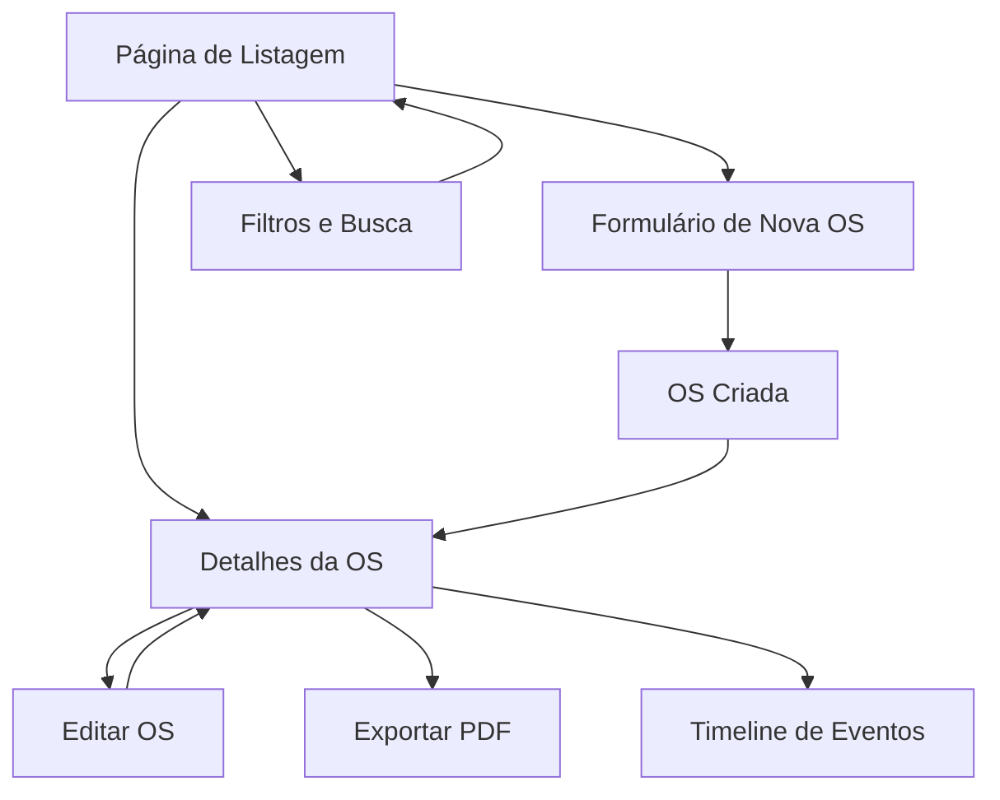

# Módulo Ordens de Serviço (Beta) - Documento de Requisitos do Produto

## 1. Visão Geral do Produto

O módulo "Ordens de Serviço (Beta)" é uma extensão do sistema OneDrip Blueberry que permite aos usuários gerenciar ordens de serviço técnico de forma completa e profissional. O módulo oferece controle total sobre o ciclo de vida de reparos, desde a criação até a entrega, incluindo gestão de peças, mão de obra, pagamentos e histórico detalhado.

Este módulo resolve a necessidade de profissionais de assistência técnica terem um sistema integrado para gerenciar seus serviços, complementando o sistema de orçamentos já existente. O produto visa aumentar a eficiência operacional e profissionalizar o atendimento ao cliente.

## 2. Funcionalidades Principais

### 2.1 Papéis de Usuário

| Papel          | Método de Registro                | Permissões Principais                                              |
| -------------- | --------------------------------- | ------------------------------------------------------------------ |
| Usuário Normal | Ativação via feature flag         | Pode criar, visualizar e gerenciar suas próprias ordens de serviço |
| Administrador  | Função is\_current\_user\_admin() | Pode visualizar e gerenciar todas as ordens de serviço do sistema  |

### 2.2 Módulos de Funcionalidade

Nosso sistema de ordens de serviço consiste nas seguintes páginas principais:

1. **Página de Listagem**: filtros por status e prioridade, busca unificada, ações rápidas (ver, editar, duplicar, marcar como pago, excluir)
2. **Página de Formulário**: seções para cliente, dispositivo, itens, problema reportado, entrega e pagamento
3. **Página de Detalhes**: abas para resumo, itens, timeline, anexos e histórico completo
4. **Página de Configurações**: ativação da feature flag beta para usuários autorizados

### 2.3 Detalhes das Páginas

| Nome da Página     | Nome do Módulo             | Descrição da Funcionalidade                                                                                                                                                                                                                                                   |
| ------------------ | -------------------------- | ----------------------------------------------------------------------------------------------------------------------------------------------------------------------------------------------------------------------------------------------------------------------------- |
| Listagem de OS     | Lista Principal            | Exibir todas as ordens com filtros por status (aberta, em andamento, concluída, entregue), prioridade (baixa, média, alta, urgente), busca por cliente/IMEI/modelo. Ações rápidas: visualizar, editar, duplicar, marcar como pago, excluir                                    |
| Formulário de OS   | Criação/Edição             | Seção Cliente (autocomplete com clientes existentes), Seção Dispositivo (tipo, modelo, IMEI/serial), Seção Itens (adicionar peças e mão de obra com preços), Seção Problema (descrição detalhada), Seção Entrega (data prevista, garantia), Seção Pagamento (valores, status) |
| Detalhes da OS     | Visualização Completa      | Aba Resumo (informações gerais), Aba Itens (lista de peças e serviços), Aba Timeline (histórico de eventos), Aba Anexos (fotos e documentos), Aba Histórico (log de alterações). Exportar PDF completo                                                                        |
| Configurações Beta | Ativação de Funcionalidade | Permitir ativação/desativação da feature flag service\_orders\_beta\_enabled para usuários autorizados                                                                                                                                                                        |

## 3. Processo Principal

### Fluxo do Usuário Normal

1. Usuário acessa a listagem de ordens de serviço
2. Cria nova ordem preenchendo dados do cliente, dispositivo e problema
3. Adiciona itens (peças e mão de obra) conforme necessário
4. Acompanha o progresso através da timeline de eventos
5. Marca como pago quando receber o pagamento
6. Finaliza a ordem e marca como entregue
7. Pode exportar relatório em PDF para o cliente

### Fluxo do Administrador

1. Visualiza dashboard com métricas gerais do sistema
2. Pode acessar qualquer ordem de serviço de qualquer usuário
3. Ativa/desativa feature flag beta para usuários específicos
4. Monitora logs de auditoria e atividades do sistema

## 4. Design da Interface do Usuário

### 4.1 Estilo de Design

* **Cores Primárias**: Azul (#3B82F6) para ações principais, Verde (#10B981) para status positivos

* **Cores Secundárias**: Cinza (#6B7280) para textos secundários, Vermelho (#EF4444) para alertas

* **Estilo de Botões**: Arredondados (rounded-lg) com sombras sutis, estilo moderno

* **Fontes**: Inter como fonte principal, tamanhos 14px (corpo), 16px (títulos), 12px (legendas)

* **Layout**: Grid responsivo baseado em cards, navegação superior fixa no mobile

* **Ícones**: Lucide React com estilo outline, tamanho 20px padrão

### 4.2 Visão Geral do Design das Páginas

| Nome da Página   | Nome do Módulo      | Elementos da UI                                                                                                                                        |
| ---------------- | ------------------- | ------------------------------------------------------------------------------------------------------------------------------------------------------ |
| Listagem de OS   | Header com Filtros  | Barra de busca global, filtros dropdown (status, prioridade), botão "Nova OS" destacado. Cards responsivos com badges coloridos para status            |
| Listagem de OS   | Grid de Cards       | Layout em grid 1-2-3 colunas (mobile-tablet-desktop), cada card mostra cliente, dispositivo, status, valor total, data. Ações rápidas em menu dropdown |
| Formulário de OS | Seções Colapsáveis  | Accordion com seções Cliente, Dispositivo, Itens, Problema, Entrega, Pagamento. Validação em tempo real, autosave local                                |
| Formulário de OS | Gestão de Itens     | Tabela dinâmica para adicionar/remover peças e mão de obra, cálculo automático de totais, campos de garantia                                           |
| Detalhes da OS   | Navegação por Abas  | Tabs horizontais no desktop, accordion no mobile. Header fixo com informações principais e ações                                                       |
| Detalhes da OS   | Timeline de Eventos | Lista cronológica com ícones, cores por tipo de evento, timestamps relativos                                                                           |

### 4.3 Responsividade

O produto é mobile-first com adaptação progressiva para desktop. Inclui otimizações específicas para iOS (touch targets 44px mínimo, scroll suave, gestos de swipe). Interface otimizada para uso com uma mão no mobile.

## 5. Feature Flag e Controle de Acesso

O módulo utiliza uma feature flag `service_orders_beta_enabled` na tabela `user_profiles` para controlar o acesso. Por padrão, a flag é `false` e deve ser ativada manualmente por administradores. A interface só exibe as opções de ordens de serviço quando a flag está ativa ou quando o usuário é administrador.

## 6. Integração com Sistema Existente

O módulo reutiliza componentes existentes do sistema OneDrip Blueberry:

* Tabela `clients` para autocomplete de clientes

* Tabela `device_types` para tipos de dispositivos

* Sistema de autenticação e RLS existente

* Componentes shadcn/ui para consistência visual

* Hooks de segurança já implementados

* Sistema de PDF generation existente

## 7. Métricas e Telemetria

O sistema registra eventos importantes como:

* `os_created`: Nova ordem criada

* `os_status_changed`: Mudança de status

* `os_payment_confirmed`: Pagamento confirmado

* `os_delivered`: Ordem entregue

* `os_pdf_exported`: PDF exportado

