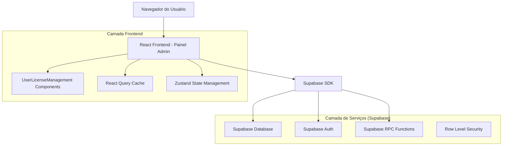
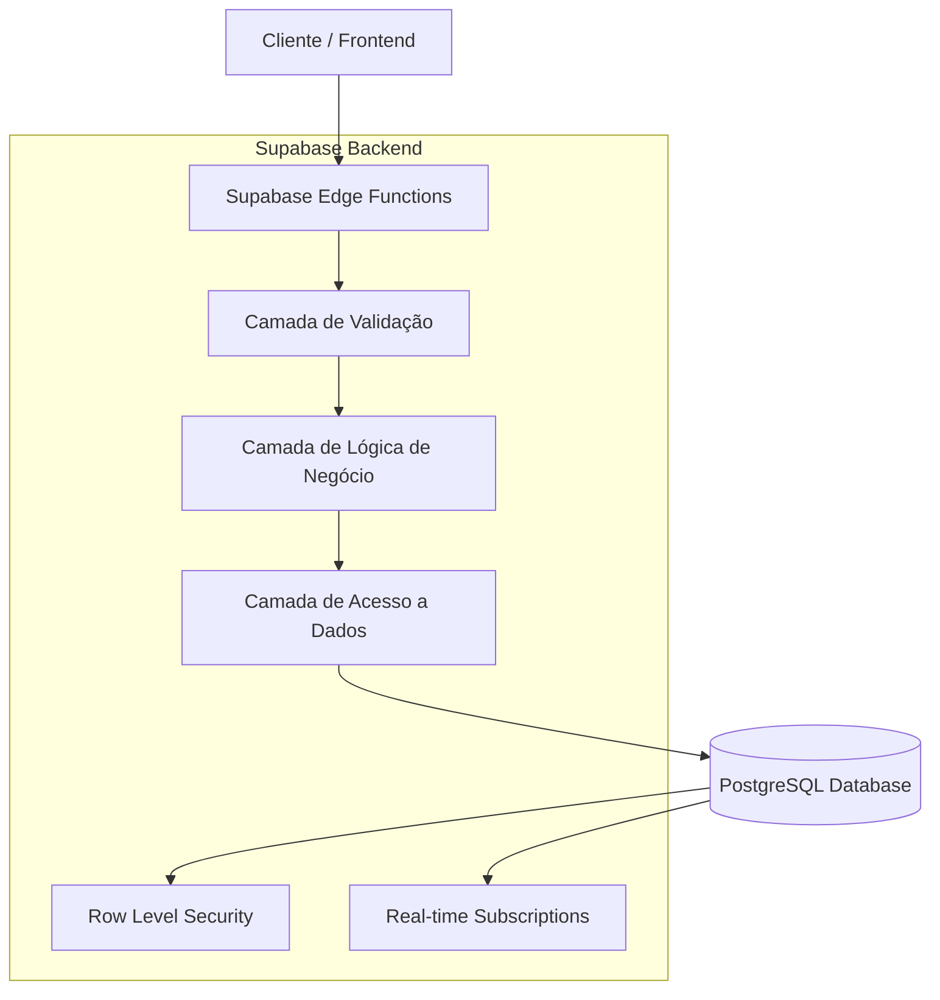
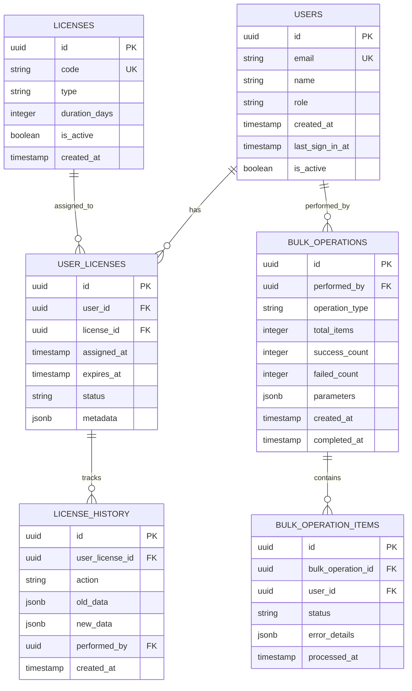

# Arquitetura Técnica - Integração de Gerenciamento de Usuários e Licenças

## 1. Design da Arquitetura



## 2. Descrição da Tecnologia

- **Frontend**: React@18 + TypeScript + TailwindCSS@3 + Vite
- **Backend**: Supabase (PostgreSQL + Auth + RPC)
- **Estado**: React Query + Zustand
- **UI Components**: Shadcn/ui + Lucide React
- **Charts**: Chart.js + React-Chartjs-2
- **Validação**: Zod + React Hook Form

## 3. Definições de Rotas

| Rota | Propósito |
|------|----------|
| /admin | Painel administrativo principal com dashboard unificado |
| /admin/users | Lista integrada de usuários com informações de licença |
| /admin/users/:id | Perfil detalhado do usuário com gestão de licenças |
| /admin/licenses | Gerenciamento avançado de licenças |
| /admin/analytics | Dashboard de métricas e relatórios |
| /admin/bulk-operations | Interface para operações em lote |
| /admin/settings | Configurações de automação e regras |

## 4. Definições da API

### 4.1 API Principal

**Busca de usuários com licenças**
```
RPC: admin_get_users_with_licenses
```

Parâmetros:
| Nome do Parâmetro | Tipo | Obrigatório | Descrição |
|-------------------|------|-------------|-----------|
| search_term | string | false | Termo de busca para nome/email |
| license_status | string | false | Filtro por status da licença |
| limit_count | integer | false | Limite de resultados |
| offset_count | integer | false | Offset para paginação |

Resposta:
| Nome do Parâmetro | Tipo | Descrição |
|-------------------|------|-----------|
| users | array | Lista de usuários com dados de licença |
| total_count | integer | Total de usuários encontrados |

Exemplo:
```json
{
  "users": [
    {
      "id": "uuid",
      "name": "João Silva",
      "email": "joao@email.com",
      "license_status": "active",
      "license_expires_at": "2024-12-31",
      "license_type": "premium"
    }
  ],
  "total_count": 150
}
```

**Operações em lote de licenças**
```
RPC: admin_bulk_license_operations
```

Parâmetros:
| Nome do Parâmetro | Tipo | Obrigatório | Descrição |
|-------------------|------|-------------|-----------|
| user_ids | array | true | IDs dos usuários selecionados |
| operation_type | string | true | Tipo de operação (renew, revoke, assign) |
| license_data | object | false | Dados específicos da licença |

Resposta:
| Nome do Parâmetro | Tipo | Descrição |
|-------------------|------|-----------|
| success_count | integer | Número de operações bem-sucedidas |
| failed_count | integer | Número de operações falhadas |
| errors | array | Lista de erros ocorridos |

**Analytics de licenças**
```
RPC: admin_get_license_analytics
```

Parâmetros:
| Nome do Parâmetro | Tipo | Obrigatório | Descrição |
|-------------------|------|-------------|-----------|
| date_from | date | false | Data inicial do período |
| date_to | date | false | Data final do período |
| group_by | string | false | Agrupamento (day, week, month) |

Resposta:
| Nome do Parâmetro | Tipo | Descrição |
|-------------------|------|-----------|
| active_licenses | integer | Licenças ativas |
| expired_licenses | integer | Licenças expiradas |
| renewal_rate | float | Taxa de renovação |
| usage_trends | array | Tendências de uso por período |

## 5. Arquitetura do Servidor



## 6. Modelo de Dados

### 6.1 Definição do Modelo de Dados



### 6.2 Linguagem de Definição de Dados

**Tabela de Licenças de Usuário (user_licenses)**
```sql
-- Criar tabela
CREATE TABLE user_licenses (
    id UUID PRIMARY KEY DEFAULT gen_random_uuid(),
    user_id UUID NOT NULL REFERENCES auth.users(id) ON DELETE CASCADE,
    license_id UUID NOT NULL REFERENCES licenses(id) ON DELETE CASCADE,
    assigned_at TIMESTAMP WITH TIME ZONE DEFAULT NOW(),
    expires_at TIMESTAMP WITH TIME ZONE NOT NULL,
    status VARCHAR(20) DEFAULT 'active' CHECK (status IN ('active', 'expired', 'revoked', 'suspended')),
    metadata JSONB DEFAULT '{}',
    created_at TIMESTAMP WITH TIME ZONE DEFAULT NOW(),
    updated_at TIMESTAMP WITH TIME ZONE DEFAULT NOW(),
    UNIQUE(user_id, license_id, assigned_at)
);

-- Criar índices
CREATE INDEX idx_user_licenses_user_id ON user_licenses(user_id);
CREATE INDEX idx_user_licenses_license_id ON user_licenses(license_id);
CREATE INDEX idx_user_licenses_status ON user_licenses(status);
CREATE INDEX idx_user_licenses_expires_at ON user_licenses(expires_at);

-- Políticas RLS
ALTER TABLE user_licenses ENABLE ROW LEVEL SECURITY;

CREATE POLICY "Admins can manage all user licenses" ON user_licenses
    FOR ALL USING (
        EXISTS (
            SELECT 1 FROM profiles 
            WHERE profiles.id = auth.uid() 
            AND profiles.role = 'admin'
        )
    );

CREATE POLICY "Users can view their own licenses" ON user_licenses
    FOR SELECT USING (user_id = auth.uid());
```

**Tabela de Histórico de Licenças (license_history)**
```sql
-- Criar tabela
CREATE TABLE license_history (
    id UUID PRIMARY KEY DEFAULT gen_random_uuid(),
    user_license_id UUID NOT NULL REFERENCES user_licenses(id) ON DELETE CASCADE,
    action VARCHAR(50) NOT NULL,
    old_data JSONB,
    new_data JSONB,
    performed_by UUID REFERENCES auth.users(id),
    created_at TIMESTAMP WITH TIME ZONE DEFAULT NOW()
);

-- Criar índices
CREATE INDEX idx_license_history_user_license_id ON license_history(user_license_id);
CREATE INDEX idx_license_history_action ON license_history(action);
CREATE INDEX idx_license_history_created_at ON license_history(created_at DESC);

-- Trigger para auditoria automática
CREATE OR REPLACE FUNCTION log_license_changes()
RETURNS TRIGGER AS $$
BEGIN
    IF TG_OP = 'UPDATE' THEN
        INSERT INTO license_history (user_license_id, action, old_data, new_data, performed_by)
        VALUES (NEW.id, 'update', to_jsonb(OLD), to_jsonb(NEW), auth.uid());
        RETURN NEW;
    ELSIF TG_OP = 'INSERT' THEN
        INSERT INTO license_history (user_license_id, action, new_data, performed_by)
        VALUES (NEW.id, 'create', to_jsonb(NEW), auth.uid());
        RETURN NEW;
    ELSIF TG_OP = 'DELETE' THEN
        INSERT INTO license_history (user_license_id, action, old_data, performed_by)
        VALUES (OLD.id, 'delete', to_jsonb(OLD), auth.uid());
        RETURN OLD;
    END IF;
    RETURN NULL;
END;
$$ LANGUAGE plpgsql;

CREATE TRIGGER license_audit_trigger
    AFTER INSERT OR UPDATE OR DELETE ON user_licenses
    FOR EACH ROW EXECUTE FUNCTION log_license_changes();
```

**Função RPC para buscar usuários com licenças**
```sql
CREATE OR REPLACE FUNCTION admin_get_users_with_licenses(
    search_term TEXT DEFAULT NULL,
    license_status TEXT DEFAULT NULL,
    limit_count INTEGER DEFAULT 50,
    offset_count INTEGER DEFAULT 0
)
RETURNS TABLE (
    id UUID,
    email TEXT,
    name TEXT,
    role TEXT,
    license_status TEXT,
    license_expires_at TIMESTAMP WITH TIME ZONE,
    license_type TEXT,
    last_sign_in_at TIMESTAMP WITH TIME ZONE,
    total_count BIGINT
)
LANGUAGE plpgsql
SECURITY DEFINER
AS $$
BEGIN
    -- Verificar se o usuário é admin
    IF NOT EXISTS (
        SELECT 1 FROM profiles 
        WHERE profiles.id = auth.uid() 
        AND profiles.role = 'admin'
    ) THEN
        RAISE EXCEPTION 'Acesso negado: apenas administradores podem executar esta função';
    END IF;
    
    RETURN QUERY
    WITH user_data AS (
        SELECT 
            u.id,
            u.email,
            p.name,
            p.role,
            CASE 
                WHEN ul.status = 'active' AND ul.expires_at > NOW() THEN 'active'
                WHEN ul.expires_at <= NOW() THEN 'expired'
                WHEN ul.status = 'revoked' THEN 'revoked'
                ELSE 'inactive'
            END as license_status,
            ul.expires_at as license_expires_at,
            l.type as license_type,
            u.last_sign_in_at,
            COUNT(*) OVER() as total_count
        FROM auth.users u
        LEFT JOIN profiles p ON p.id = u.id
        LEFT JOIN user_licenses ul ON ul.user_id = u.id AND ul.status = 'active'
        LEFT JOIN licenses l ON l.id = ul.license_id
        WHERE 
            (search_term IS NULL OR 
             p.name ILIKE '%' || search_term || '%' OR 
             u.email ILIKE '%' || search_term || '%')
        AND 
            (license_status IS NULL OR 
             CASE 
                WHEN ul.status = 'active' AND ul.expires_at > NOW() THEN 'active'
                WHEN ul.expires_at <= NOW() THEN 'expired'
                WHEN ul.status = 'revoked' THEN 'revoked'
                ELSE 'inactive'
             END = license_status)
        ORDER BY p.name
        LIMIT limit_count
        OFFSET offset_count
    )
    SELECT * FROM user_data;
END;
$$;

-- Conceder permissões
GRANT EXECUTE ON FUNCTION admin_get_users_with_licenses TO authenticated;
```

**Função RPC para operações em lote**
```sql
CREATE OR REPLACE FUNCTION admin_bulk_license_operations(
    user_ids UUID[],
    operation_type TEXT,
    license_data JSONB DEFAULT '{}'
)
RETURNS TABLE (
    success_count INTEGER,
    failed_count INTEGER,
    errors JSONB
)
LANGUAGE plpgsql
SECURITY DEFINER
AS $$
DECLARE
    user_id UUID;
    success_cnt INTEGER := 0;
    failed_cnt INTEGER := 0;
    error_list JSONB := '[]';
    bulk_op_id UUID;
BEGIN
    -- Verificar permissões de admin
    IF NOT EXISTS (
        SELECT 1 FROM profiles 
        WHERE profiles.id = auth.uid() 
        AND profiles.role = 'admin'
    ) THEN
        RAISE EXCEPTION 'Acesso negado: apenas administradores podem executar esta função';
    END IF;
    
    -- Criar registro da operação em lote
    INSERT INTO bulk_operations (performed_by, operation_type, total_items, parameters)
    VALUES (auth.uid(), operation_type, array_length(user_ids, 1), license_data)
    RETURNING id INTO bulk_op_id;
    
    -- Processar cada usuário
    FOREACH user_id IN ARRAY user_ids
    LOOP
        BEGIN
            CASE operation_type
                WHEN 'renew' THEN
                    UPDATE user_licenses 
                    SET expires_at = expires_at + INTERVAL '1 day' * (license_data->>'additional_days')::INTEGER,
                        updated_at = NOW()
                    WHERE user_id = user_id AND status = 'active';
                    
                WHEN 'revoke' THEN
                    UPDATE user_licenses 
                    SET status = 'revoked',
                        updated_at = NOW()
                    WHERE user_id = user_id AND status = 'active';
                    
                WHEN 'assign' THEN
                    INSERT INTO user_licenses (user_id, license_id, expires_at)
                    VALUES (
                        user_id, 
                        (license_data->>'license_id')::UUID,
                        NOW() + INTERVAL '1 day' * (license_data->>'duration_days')::INTEGER
                    );
            END CASE;
            
            -- Registrar sucesso
            INSERT INTO bulk_operation_items (bulk_operation_id, user_id, status, processed_at)
            VALUES (bulk_op_id, user_id, 'success', NOW());
            
            success_cnt := success_cnt + 1;
            
        EXCEPTION WHEN OTHERS THEN
            -- Registrar falha
            INSERT INTO bulk_operation_items (bulk_operation_id, user_id, status, error_details, processed_at)
            VALUES (bulk_op_id, user_id, 'failed', jsonb_build_object('error', SQLERRM), NOW());
            
            error_list := error_list || jsonb_build_object(
                'user_id', user_id,
                'error', SQLERRM
            );
            failed_cnt := failed_cnt + 1;
        END;
    END LOOP;
    
    -- Atualizar registro da operação em lote
    UPDATE bulk_operations 
    SET success_count = success_cnt,
        failed_count = failed_cnt,
        completed_at = NOW()
    WHERE id = bulk_op_id;
    
    RETURN QUERY SELECT success_cnt, failed_cnt, error_list;
END;
$$;

-- Conceder permissões
GRANT EXECUTE ON FUNCTION admin_bulk_license_operations TO authenticated;
```